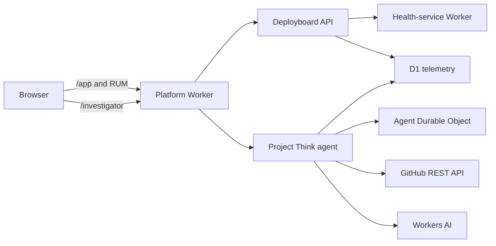

# Regression Surgeon — Implementation Plan

## 1. Product definition

Regression Surgeon is a Cloudflare-native agent that connects a measured UX latency regression to backend traces, identifies the first bad deployment and its GitHub commit or pull request, and proposes a minimal evidence-backed fix as a guarded draft PR.

The demonstration path is deliberately narrow:

1. A supervised full-stack application reports a degraded UX metric.
2. The Project Think agent compares the current release with a known-good baseline.
3. It inspects representative traces and finds the critical path.
4. It maps the first bad Worker version to a Git commit and PR.
5. It reads only the relevant repository files.
6. It explains the likely cause, confidence, and remaining uncertainty.
7. After explicit approval, it creates or reuses a guarded draft PR.

## 2. Fixed architectural decisions

| Area | Decision |
| --- | --- |
| Hosting | Cloudflare Workers only |
| Agent harness | Project Think |
| Model | Workers AI through `workers-ai-provider` |
| Frontend | React SPA built with Vite |
| Server | Cloudflare Worker API |
| Agent state | Project Think's SQLite-backed Durable Object |
| Telemetry | Application-owned, measured telemetry stored in D1 |
| Repository | pnpm workspace monorepo |
| Development method | Strict test-driven development |
| Local runtime | Cloudflare Vite plugin, Miniflare, and `workerd` |
| Tool management | mise |
| Supported hosts | macOS and Linux, ARM64 and x64 |
| Supported shells | sh, Bash, Zsh, Fish, and Nu |
| Optional containers | Colima with Compose |
| GitHub runtime integration | GitHub REST API through constrained Worker tools |
| PR behavior | Approved, guarded, idempotent draft PR only |

## 3. Node and Workers runtime

The development toolchain uses Node.js 24.18.0:

```toml
node = "24.18.0"
```

Reasons:

- Project Think currently requires Node 24 or newer.
- Node 24 is an LTS release.
- Wrangler 4.110.0 requires Node 22 or newer.
- The deployed application does not run in Node. It runs in Cloudflare's `workerd` runtime.

Every Worker configuration pins:

```jsonc
{
  "compatibility_date": "2026-07-11",
  "compatibility_flags": ["nodejs_compat"]
}
```

The compatibility date is updated deliberately, never automatically. Cloudflare implements a subset of Node APIs, and some available imports remain non-functional stubs.

References:

- [Project Think getting started](https://developers.cloudflare.com/agents/harnesses/think/getting-started/)
- [Workers Node.js compatibility](https://developers.cloudflare.com/workers/runtime-apis/nodejs/)
- [Node.js release schedule](https://nodejs.org/en/about/previous-releases)

## 4. Repository layout

```text
.
├── apps/
│   └── web/
│       ├── src/
│       │   ├── supervised/       # Deployboard UI
│       │   ├── investigator/     # Think chat UI
│       │   └── shared/
│       └── index.html
│
├── workers/
│   ├── platform/
│   │   └── src/
│   │       ├── agent/            # Think model, evidence tools, and services
│   │       ├── api/              # Supervised application API
│   │       ├── github/           # GitHub REST adapter
│   │       ├── telemetry/        # D1 ingestion and queries
│   │       └── index.ts
│   │
│   └── health-service/
│       └── src/
│           └── index.ts          # Auxiliary dependency Worker
│
├── packages/
│   ├── contracts/                # Shared schemas and types
│   ├── telemetry/                # Browser/server instrumentation
│   └── test-fixtures/            # GitHub and model fixtures
│
├── migrations/
│   └── telemetry/
├── scripts/
│   ├── bootstrap                 # Source from sh/bash/zsh
│   ├── bootstrap.fish
│   ├── bootstrap.nu
│   ├── bootstrap-core.sh
│   ├── activate
│   ├── activate.fish
│   ├── activate.nu
│   ├── teardown
│   ├── teardown.fish
│   ├── teardown.nu
│   ├── doctor.mjs
│   ├── dev.mjs
│   ├── e2e.mjs
│   └── seed-demo.mjs
├── compose.yaml
├── Containerfile
├── mise.toml
├── mise.lock
├── pnpm-workspace.yaml
├── pnpm-lock.yaml
├── vite.config.ts
└── wrangler.jsonc
```

The platform Worker serves both experiences:

- `/app` — supervised Deployboard application
- `/investigator` — Regression Surgeon chat
- `/api/*` — supervised application and telemetry endpoints
- `/agents/*` — Project Think protocol

The health service runs as an auxiliary Worker connected through a service binding. This creates a real multi-Worker request path without requiring multiple public deployments for the MVP.

Cloudflare recommends running tightly coupled Workers through one development command because it provides the best binding compatibility. The Vite plugin supports this through `auxiliaryWorkers`.

Reference: [Developing with multiple Workers](https://developers.cloudflare.com/workers/local-development/multi-workers/)

## 5. Runtime architecture



## 6. mise toolchain

The initial `mise.toml` contract is:

```toml
min_version = "2026.6.14"

[settings]
lockfile = true

[tools]
node = "24.18.0"
wrangler = { version = "4.110.0", depends = ["node"] }
gh = "2.96.0"
shellcheck = "0.11.0"
shfmt = "3.13.1"
actionlint = "1.7.12"
"github:nushell/nushell" = "0.113.1"

# Optional container lane. These are not installed on unsupported hosts.
colima = { version = "0.10.3", os = ["macos", "linux"] }
docker-cli = { version = "29.6.1", os = ["macos", "linux"] }
docker-compose = { version = "5.3.1", os = ["macos", "linux"] }
```

Commit `mise.lock` with platform entries for:

- macOS ARM64
- macOS x64
- Linux ARM64
- Linux x64

mise owns external executables. The mise-managed Node runtime supplies Corepack, which provisions the exact `pnpm@10.34.5` declared by the root `packageManager` field inside the repository-local tool tree. This avoids an incomplete package-manager backend catalog while keeping every executable root under mise. pnpm owns source-linked JavaScript libraries such as React, Think, the Cloudflare Vite plugin, TypeScript, and Vitest.

The Cloudflare Vite plugin itself depends on Wrangler. The pnpm lockfile may therefore also contain Wrangler, but its version must match the mise-pinned 4.110.0.

References:

- [Installing mise](https://mise.jdx.dev/installing-mise.html)
- [mise lockfiles](https://mise.jdx.dev/dev-tools/mise-lock.html)

## 7. Session-local bootstrap contract

Bootstrap supports only macOS and Linux on ARM64 and x64.

| Shell | Bootstrap command |
| --- | --- |
| sh | `. ./scripts/bootstrap` |
| Bash | `source ./scripts/bootstrap` |
| Zsh | `source ./scripts/bootstrap` |
| Fish | `source ./scripts/bootstrap.fish` |
| Nu | `source ./scripts/bootstrap.nu` |

The command must be run from the repository root. Each entrypoint verifies that `mise.toml` is present before continuing.

Bootstrap must be sourced because an executed child process cannot modify its parent shell.

### 7.1 Isolation rules

Bootstrap will:

- Install mise into `.local/bin/mise`.
- Store mise-installed tools under the repository's `.local/` directory.
- Store mise cache and state under `.local/`.
- Add mise and its tools to `PATH` only in the active shell.
- Activate mise only in the active shell.
- Never modify `.profile`, `.bashrc`, `.zshrc`, Fish configuration, or Nu configuration.
- Never install mise into `/usr/local/bin` or another system path.
- Never spawn a replacement login shell.
- Remain idempotent when sourced repeatedly.

The shell adapters set repository-local paths before calling the shared core:

```text
MISE_INSTALL_PATH=.local/bin/mise
MISE_DATA_DIR=.local/share/mise
MISE_CACHE_DIR=.local/cache/mise
MISE_STATE_DIR=.local/state/mise
MISE_GLOBAL_CONFIG_FILE=.local/mise-global.toml
MISE_CONFIG_DIR=.local/config/mise
```

The adapters also add the user's normal global mise config to `MISE_IGNORED_CONFIG_PATHS`. This prevents unrelated personal tools or aliases from leaking into a repository bootstrap.

When the terminal closes, activation and environment changes disappear. Downloaded repository-local tools remain cached until teardown.

### 7.2 Bootstrap implementation

The common `bootstrap-core.sh` performs filesystem and installation work but does not attempt to alter the calling shell.

The shell adapters then expose the repository toolchain:

- sh prepends the repository's mise shims because mise has no plain-`sh` activation mode.
- Bash uses `mise activate bash`.
- Zsh uses `mise activate zsh`.
- Fish pipes `mise activate fish` into `source`.
- Nu prepends the repository's mise shims and binary directory to its current-session path.

### 7.3 Consent behavior

The shared bootstrap core uses single-keystroke confirmations for:

- Installing mise locally
- Trusting the repository's mise configuration
- Installing pinned tools
- Installing pnpm dependencies
- Applying local D1 migrations
- Loading deterministic fixtures
- Running the build and local verification suite

Prompts default to yes and use the form:

```text
Install the repository-local mise toolchain? [Y/n]
```

The TTY reader must restore terminal state after every response and on interruption.

Bootstrap never prompts about shell profiles because persistent activation is forbidden.

### 7.4 Activation after bootstrap

Subsequent terminal sessions can source a lightweight activation script without repeating installation:

| Shell | Activation command |
| --- | --- |
| sh | `. ./scripts/activate` |
| Bash | `source ./scripts/activate` |
| Zsh | `source ./scripts/activate` |
| Fish | `source ./scripts/activate.fish` |
| Nu | `source ./scripts/activate.nu` |

## 8. Teardown behavior

Default teardown removes only repository-owned state:

- Managed local Worker processes
- Project Compose resources
- The named `polylane-take-home` Colima profile, if created by this project
- `.wrangler/state`
- `.local/run`
- Build output and coverage
- Generated fixture databases

It must not:

- Modify shell profiles
- Remove unrelated Colima profiles, containers, or volumes
- Delete `.dev.vars`
- Remove the repository-local mise installation unless explicitly requested

An explicit purge mode may additionally remove:

- `node_modules`
- Repository-local mise tools and cache
- Generated local secrets
- Project container volumes

Every additional removal requires confirmation.

Because bootstrap affects only the current shell, teardown does not attempt to edit the parent shell's environment. The current session ends naturally or can run the matching mise deactivation command.

## 9. mise tasks

Complex orchestration lives in cross-platform `.mjs` files rather than shell-specific task bodies.

| Task | Purpose |
| --- | --- |
| `mise run doctor` | Verify versions, ports, configuration, credentials, and bindings |
| `mise run install` | Install pnpm dependencies |
| `mise run build` | Build every workspace package and Worker |
| `mise run format` | Apply canonical formatting |
| `mise run format:check` | Verify formatting without modifying files |
| `mise run lint` | Run code, configuration, and shell linting with zero warnings |
| `mise run typecheck` | Run strict TypeScript checks |
| `mise run check` | Run formatting, linting, type-checking, and tests |
| `mise run test` | Run focused unit and Worker integration tests |
| `mise run test:watch` | Run targeted tests continuously during TDD |
| `mise run db:migrate` | Apply local D1 migrations |
| `mise run db:seed` | Load deterministic investigation fixtures |
| `mise run dev` | Run the complete native stack with a fake local model |
| `mise run dev:live` | Run locally with remote Workers AI |
| `mise run e2e` | Run credential-free deterministic end-to-end verification |
| `mise run container:up` | Start the optional Colima/Compose lane |
| `mise run container:down` | Stop project container resources |
| `mise run auth:cloudflare` | Run Cloudflare authentication and status checks |
| `mise run auth:github` | Run GitHub authentication and status checks |
| `mise run deploy` | Apply remote migrations and deploy |
| `mise run teardown` | Remove repository-owned local state |

## 10. Local development strategy

### 10.1 Canonical native path

Use one Cloudflare Vite development server with:

- Platform Worker as the primary Worker
- Health service as an auxiliary Worker
- Local D1
- Local Durable Objects
- Static React assets
- Hot reload

Both Wrangler and the Cloudflare Vite plugin use Miniflare and `workerd`. Local bindings are simulated automatically.

Reference: [Cloudflare local development](https://developers.cloudflare.com/workers/local-development/)

### 10.2 Local model behavior

Workers AI bindings execute remotely even when Worker code runs locally. The project therefore supports two model modes:

- `fake` — deterministic AI SDK model for tests and credential-free E2E
- `workers-ai` — real Workers AI binding for interactive development and production

`mise run e2e` uses the fake model and GitHub fixtures. It exercises:

- Think's multi-step loop
- Tool calls and results
- Telemetry investigation
- Commit and PR correlation
- Structured evidence, inference, confidence, and unknowns

It never calls a live model or writes to GitHub. The same E2E now validates an evidence-rich draft-PR
preview, while rendered-browser verification covers the native approval request and continuation.

`mise run dev:live` uses Workers AI and requires Cloudflare authentication.

### 10.3 Optional Colima lane

Colima is never started by bootstrap. The user must explicitly run:

```text
mise run container:up
```

The task uses a named Colima profile:

```text
polylane-take-home
```

Compose runs the same mise task inside one Linux container. It is not a separate application architecture.

The container will:

- Install mise into the container image.
- Run `mise install`.
- Install pnpm dependencies into Linux-owned volumes.
- Start the same Vite and `workerd` stack.
- Expose the same local URL.

Host `node_modules` must not be mounted into the container because `workerd` and related packages contain platform-specific binaries.

The native path remains the documented default. The Compose lane exists for Linux parity and clean-room verification.

## 11. Supervised application and intentional regression

Status: implemented in issue #6. Commit `cf25e52` is the real known-good concurrent release. The
issue #6 pull request introduces the sequential transition with the stated intent of reducing
simultaneous downstream pressure. Local scenario controls are available only when explicitly enabled
in fake mode, addressed through a loopback host, and presented with the fixed local key; live mode
disables them.

Deployboard displays health data for a collection of software services.

The initial implementation loads health statuses concurrently:

```ts
const statuses = await Promise.all(
  serviceIds.map((id) => healthService.getStatus(id)),
);
```

The intentional regression changes the behavior to sequential requests, framed as an attempt to reduce downstream request pressure:

```ts
const statuses = [];

for (const id of serviceIds) {
  statuses.push(await healthService.getStatus(id));
}
```

This produces:

- Increased `service_grid_ready_ms`
- Increased API wall time
- Repeated sequential health-service spans
- A clear first bad release
- A meaningful source diff and PR rationale

The expected surgical fix uses batching or bounded concurrency rather than blindly reverting the change.

The regression exists as a real commit associated with a real PR in repository history.

`mise run scenario:reseed` removes only the two controlled releases, sends 20 concurrent and 20
sequential interactions through the real local service binding, stores their measured D1 evidence,
then verifies a ready comparison and sequential slow-trace critical path. `mise run scenario:reset`
performs the scoped deletion independently. Neither operation writes an agent conclusion or modifies
unrelated telemetry.

## 12. Telemetry model

Primary D1 tables:

```text
releases
  release_id, git_sha, deployed_at_ms

ux_events
  event_id, interaction_id, trace_id, release_id,
  metric_name, duration_ms, outcome, recorded_at_ms

traces
  trace_id, interaction_id, release_id,
  started_at_ms, duration_ms, outcome

spans
  trace_id, span_id, parent_span_id, service_id,
  started_at_ms, duration_ms, status
```

Telemetry comes from measured application requests:

- Browser custom performance measurements
- Worker request timing
- Service-binding timing
- Status and error information
- Worker version metadata
- Git commit SHA

Native Workers observability is enabled in parallel, but D1 remains the agent's initial investigation source because it supports deterministic local reproduction and durable demo evidence.

## 13. Project Think agent

Configure:

- Workers AI model through `workers-ai-provider`
- Maximum eight tool steps per turn
- Evidence-oriented system prompt
- Tool result size limits
- Lifecycle logging
- Persistent conversation state
- Explicit confidence and unknowns in final reports

Initial tools:

### `query_telemetry`

Supports bounded operations:

- Compare release metrics
- Find slow traces
- Inspect one trace

It never accepts arbitrary SQL.

### `inspect_release`

- Resolve Worker version to commit
- Find the associated pull request
- Return bounded commit and PR metadata

### `read_repo_files`

- Read files at a specific commit
- Enforce path, file-count, and byte limits

### `create_draft_pr`

- Require explicit approval
- Validate proposed changes
- Create or return an idempotent draft PR

## 14. GitHub PR safety

The deployed Worker uses GitHub REST through `fetch`; it cannot invoke the mise-installed `gh` executable.

`gh` is used for repository setup, authentication checks, and operator workflows.

The PR tool enforces:

- One configured repository
- Draft PRs only
- Explicit Project Think approval
- Expected base SHA and blob SHA
- Allowlisted source paths
- Maximum file and changed-line limits
- No `.github`, secrets, agent code, or deployment configuration changes
- Telemetry evidence IDs in the PR body
- Incident-fingerprint idempotency
- Deterministic branch recovery after uncertain write responses
- `GITHUB_WRITE_ENABLED=false` by default
- No merge capability

Local execution returns a validated PR preview after the same server-side proposal checks and never
constructs a write-capable adapter. Live mode requires a scoped `GITHUB_TOKEN`; production write
behavior additionally requires `GITHUB_WRITE_ENABLED=true` and explicit approval of the action.

## 15. Strict TDD and test strategy

Test-driven development is the required implementation method, not an optional final verification phase.

Every behavior change follows this loop:

1. State the observable behavior or invariant being added or repaired.
2. Add the smallest test that expresses it.
3. Run the targeted test and confirm that it fails for the expected reason.
4. Add the minimum production code needed to make it pass.
5. Run the targeted test and confirm that it passes.
6. Refactor while keeping the test green.
7. Run the affected package suite and repository quality gates.

Bug fixes always begin with a regression test. Production behavior must not be written speculatively ahead of its failing test. Documentation-only changes and generated artifacts are exempt from the red step, but still require their applicable validation commands.

Coverage percentage is not the target. The target is complete protection of meaningful product invariants, boundary behavior, failure behavior, and security decisions. Tests should observe public behavior and structured outputs rather than private implementation details.

### 15.1 Meaningful product invariants

#### Supervised application

- Concurrent health loading preserves service identity and output ordering.
- A partial dependency failure produces a bounded partial result rather than losing the entire dashboard.
- The intentionally sequential implementation produces a measurable regression fixture.
- UX measurements are emitted once per completed interaction.
- Trace and release identifiers flow from server response to browser telemetry.

#### Telemetry

- Release comparisons use equivalent windows and require a minimum sample count.
- Percentiles, error rates, and deltas are correct at empty, singleton, and boundary-sized datasets.
- Clock ordering and duration units are consistent.
- Trace trees preserve parent-child relationships and tolerate missing or late spans.
- Critical-path calculation does not double-count overlapping spans.
- Queries enforce time-window, row-count, and result-size limits.
- No tool accepts arbitrary SQL.

#### Release and repository correlation

- Worker version metadata resolves to exactly one expected Git SHA.
- The first bad release is selected from measured evidence rather than commit order alone.
- A commit maps to its originating PR when GitHub returns one and degrades safely when none exists.
- Repository reads remain pinned to the requested immutable commit.
- Path traversal, oversized files, and disallowed paths are rejected.

#### Agent behavior

- The deterministic model drives a real multi-step Think tool loop.
- The agent cannot produce a fix before collecting telemetry and release evidence.
- Tool failures become bounded model-visible errors without corrupting persisted conversation state.
- Step limits terminate runaway behavior.
- Tool results are truncated deterministically before entering model context.
- Final structured reports distinguish evidence, inference, confidence, and unknowns.
- Refresh or reconnection preserves the committed conversation and does not duplicate tool effects.

Tests should assert structured messages, tool calls, state transitions, and evidence references. They should not assert incidental prose from a live model.

#### Draft PR safety

- GitHub writes are disabled by default.
- A write cannot occur without explicit approval.
- Only the configured repository and allowlisted source paths can change.
- Base SHA and blob SHA checks reject stale proposals.
- File-count, byte-count, and changed-line budgets are enforced server-side.
- `.github`, secrets, agent code, and deployment configuration remain immutable.
- Repeated execution for one incident returns the existing PR.
- Failed GitHub operations do not leave an untracked partial success.
- PR bodies contain the evidence IDs and validation plan used to justify the fix.

#### Bootstrap and local operations

- Bootstrap is idempotent for every supported shell adapter.
- It changes only the current shell environment and repository-local files.
- It never writes to a shell profile or system installation path.
- A declined prompt performs no associated mutation.
- TTY settings are restored after acceptance, rejection, failure, and interruption.
- Teardown removes only resources carrying the project's identity.
- Native and container entrypoints invoke the same underlying tasks.

### 15.2 Test layers

#### Unit tests

- Telemetry aggregation and release comparison
- Trace waterfall and critical-path calculation
- Git commit-to-PR resolution
- Repository path allowlisting
- Patch size and stale-blob validation
- Incident fingerprint and PR idempotency
- Prompt-independent report and evidence structures

#### Worker integration tests

- D1 migrations and queries under the Workers test runtime
- Platform-to-health-service binding calls
- Think tool schemas and error behavior
- Agent state persistence and reconnection
- Approval and write-disable enforcement

#### Shell contract tests

- sh, Bash, and Zsh adapters in isolated temporary homes
- Fish syntax and session-local activation
- Nu syntax and session-local activation
- Profile files remain byte-for-byte unchanged
- Bootstrap and teardown remain idempotent

#### End-to-end verification

The deterministic fake model follows a realistic investigation path:

1. Query release metrics.
2. Inspect representative slow traces.
3. Inspect the first bad release.
4. Read the relevant implementation.
5. Produce a structured evidence report.

The E2E runner starts the actual local Worker stack, waits for readiness, loads measured scenario
evidence, submits the investigation prompt through a local-only Durable Object RPC, observes the five
tool events, and validates the trace-, commit-, and PR-backed report. Browser verification separately
proves the rendered timeline and reconnect behavior. The E2E then validates a same-trace remediation
preview with zero external writes. Rendered-browser verification proves that the action parks before
execution, exposes one file and its evidence trace, and continues only after explicit approval.

End-to-end tests must not depend on a live LLM, GitHub writes, wall-clock sleeps, unseeded randomness, or shared mutable remote data.

### 15.3 Linting and formatting gates

- TypeScript uses strict compiler settings with no unchecked escape hatches.
- JavaScript, TypeScript, JSON, and JSONC use one canonical formatter and linter configuration.
- Markdown is linted for structural consistency.
- POSIX shell is checked with ShellCheck and formatted with `shfmt`.
- Fish scripts are validated and formatted with Fish tooling.
- Nu scripts are parsed and checked by Nu.
- Lint warnings fail CI; warning budgets are not allowed.
- Suppressions must be narrow, explained inline, and protected by a test when they affect behavior.
- Generated files are checked for reproducibility and drift.

The root `AGENTS.md` is the authoritative contributor contract for TDD, quality gates, and completion criteria.

## 16. Implementation phases

### Phase 1 — Foundation

Status: complete in issue #2. The real repository-local bootstrap, doctor, build, aggregate checks, and foundation E2E suite pass on macOS ARM64. The macOS/Linux CI matrix supplies cross-platform and Fish execution evidence.

- Initialize the pnpm workspace.
- Add mise configuration and lockfile.
- Add the root `AGENTS.md` contributor contract.
- Implement shell-local bootstrap and activation adapters.
- Implement doctor, teardown, and build tasks.
- Add formatting, linting, strict type-checking, and test tasks.
- Add initial CI verification.

Acceptance criteria:

- A clean checkout can install and build through mise on macOS/Linux.
- No bootstrap path modifies shell profiles or system installation paths.
- Activation disappears when the terminal session ends.
- A deliberately failing test proves the red phase before the first production behavior is implemented.
- `mise run check` passes with zero warnings.

### Phase 2 — Cloudflare skeleton

Status: complete in issue #3. One Cloudflare Vite development URL now serves the React shell, the
platform Worker, a SQLite-backed Project Think Durable Object, local D1, version metadata, and the
auxiliary health-service Worker. Fake mode is credential-free and omits the remote AI binding;
`wrangler.live.jsonc` is the explicit Workers AI configuration.

- Add the React/Vite application.
- Add the platform Worker.
- Add the Think Durable Object.
- Add the Workers AI binding.
- Add the auxiliary health-service Worker.
- Configure local D1 and version metadata.

Acceptance criteria:

- `/app` and `/investigator` load from one local URL.
- The platform Worker can call the health-service binding.
- Think persists a local chat session.

### Phase 3 — Supervised application

Status: complete in issues #4 through #6. The known-good commit fans out to three concurrent
auxiliary Worker checks. The issue #6 transition intentionally serializes those checks, preserves
stable service order and bounded partial failures, and records the resulting browser, request, span,
release, and Git evidence.

- Build Deployboard.
- Implement concurrent health loading.
- Add browser performance measurement.
- Add the intentional regression as a separate commit and PR.

Acceptance criteria:

- The regression produces a visible and repeatable latency increase.
- Both browser and server measurements carry release metadata.

### Phase 4 — Telemetry

Status: complete in issues #5 and #6. D1 stores immutable releases, UX events, traces, and spans from
real application requests. Fixed query methods enforce time, row, and serialized-result bounds;
comparisons use equivalent release-relative windows and minimum samples; trace detail handles
missing parents and overlapping spans. The scoped local reseed supplies measured baseline and
regression traffic and verifies the degraded release and sequential critical path.

- Add D1 migrations.
- Record UX events, traces, spans, and releases.
- Implement bounded telemetry queries.
- Add baseline and regression traffic generation.

Acceptance criteria:

- A deterministic query identifies the first bad release.
- Representative traces identify the sequential dependency calls.

### Phase 5 — Read-only agent

Status: complete in issues #7 and #8. The bounded connector resolves release evidence to immutable
commits and associated PR metadata. Project Think exposes only `query_telemetry`, `inspect_release`,
and `read_repo_files`, enforces eight tool steps and deterministic result truncation, and produces a
report that separates evidence, inference, confidence, and unknowns. The credential-free E2E runs a
real five-step Think turn over measured local D1 evidence; Worker and browser checks prove durable
reconnection without duplicate messages or tool effects.

- Add `query_telemetry`, `inspect_release`, and `read_repo_files`.
- Configure prompt, step limits, and tool-event UI.
- Add deterministic fake-model E2E.

Acceptance criteria:

- The agent independently reaches the correct commit and PR.
- Its report cites telemetry and repository evidence.
- Tool failures produce bounded, understandable recovery behavior.

### Phase 6 — Draft PR

Status: complete in issue #9. `create_draft_pr` is a native Project Think action with explicit
high-risk approval, a narrow permission, and preview/write-scoped incident idempotency. The
server-side service validates configured repository and path, matching regression/base SHA, current
blob SHA, replacement byte and line bounds, changed-line count, draft-only output, evidence-rich body,
and deterministic branch state. Fake mode always returns a validated preview without network access.
The live GitHub REST adapter requires a token and remains write-disabled until the explicit flag is
set. Existing PRs are reused, and uncertain branch or PR responses return deterministic recoverable
state without creating another branch. Recovery accepts only a branch exactly one commit ahead of
the evidenced base with exactly the approved file changed. No merge endpoint or tool exists.

- Add guarded PR proposal creation.
- Add Project Think approval interaction.
- Add GitHub REST write adapter.
- Add idempotency and path/diff validation.
- Add CI checks for generated PRs.

Acceptance criteria:

- One approved investigation creates or reuses a safe draft PR.
- Repeated runs do not generate duplicate PRs.
- Disallowed changes are rejected server-side.

### Phase 7 — Deployment and evidence

- Create the remote D1 database.
- Deploy the good version and generate baseline traffic.
- Deploy the regression and generate incident traffic.
- Configure the GitHub secret and write flag.
- Deploy the public investigator.
- Perform the complete reviewer walkthrough.

Acceptance criteria:

- The public URL demonstrates symptom → trace → commit/PR → draft fix.
- The demo requires no reviewer login.
- The README documents recovery if telemetry or the PR needs resetting.

### Phase 8 — Optional container lane and documentation

- Add Colima/Compose verification.
- Finish README, architecture, tradeoffs, and limitations.
- Document reset and demo-recovery procedures.

Acceptance criteria:

- Native setup remains the primary path.
- Container setup reproduces it without changing application behavior.

## 17. Scope gates

Implement in this order:

1. Working supervised regression
2. Measured telemetry
3. Correct read-only investigation
4. Guarded draft PR
5. Reproducible local delivery
6. Public deployment
7. Optional Colima/Compose lane

Do not delay the working public investigation for container polish.

Explicit non-goals:

- Windows or PowerShell support
- Persistent shell activation
- System-wide tool installation
- Arbitrary repository onboarding
- OAuth
- Multiple telemetry providers
- Sub-agents
- Cloudflare Workflows
- Automated merging
- Automated production rollback
- General-purpose code editing
- Full native Workers Observability ingestion

## 18. Reviewer walkthrough

The intended five-minute demonstration is:

1. Open Deployboard and click **Refresh services**.
2. Observe the slow service-grid experience.
3. Open Regression Surgeon.
4. Submit **Investigate the current dashboard latency regression**.
5. Watch the agent compare releases and inspect traces.
6. Review its identification of the first bad commit and source PR.
7. Inspect the proposed bounded-concurrency fix.
8. Approve draft PR creation.
9. Follow the returned GitHub link to the evidence-backed PR.

## 19. Project-system alignment

The implementation plan, GitHub milestone and issue dependency graph, wiki, README, `AGENTS.md`, and repository-local skills form one project system.

After every meaningful change:

1. Assess whether product behavior, architecture, interfaces, data, security, operations, workflow, delivery scope, or sequencing changed.
2. Update the implementation plan when the intended or implemented direction changed.
3. Update affected issue purpose, scope, non-goals, acceptance criteria, milestone assignment, and native blocked-by relations.
4. Update the wiki and README for human readers when the product, architecture, roadmap, setup, or operations changed.
5. Update agent instructions and reusable skills when contributor workflow or safety constraints changed.
6. Run the applicable document, issue, wiki, skill, test, lint, type-check, and build validations.
7. Record which surfaces were assessed and why unchanged surfaces remain correct.

Every delivery issue contains this alignment checklist and cannot close until it is satisfied. The repository-local `align-project-system` skill is the procedural source for the assessment.

Execution is tracked in the [v1 milestone](https://github.com/alexlopashev/cloudflare-agents-demo/milestone/1) under the parent [delivery issue](https://github.com/alexlopashev/cloudflare-agents-demo/issues/1). Native GitHub blocked-by relations, not checklist ordering alone, define the actionable dependency graph.
