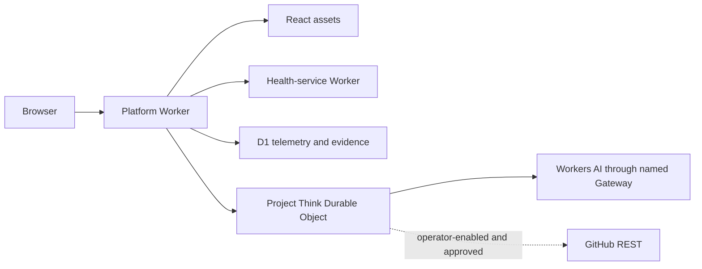

# Regression Surgeon — Current Implementation Plan

This document is the current architecture and acceptance contract. Historical rollout details,
mutable deployment identifiers, and dated proofs live in [RELEASE_READINESS.md](RELEASE_READINESS.md),
the closed milestones, and their issues.

## 1. Product contract

Regression Surgeon demonstrates one evidence-first investigation:

1. A configured incident names one measured baseline release, one degraded release, and one bounded
   trace window.
2. Project Think compares the releases, finds slow traces, inspects one trace, maps the degraded
   release to immutable Git evidence, and reads the allowlisted source.
3. The agent reports evidence, inference, confidence, and unknowns as separate sections.
4. A complete persisted receipt permits one exact remediation proposal and fingerprint.
5. The public runtime validates that proposal as a one-file, zero-write preview.
6. An operator may separately enable approval-gated draft-PR creation.

Optional current-release metric generation demonstrates ingestion but never selects or mutates the
incident. The product is not a general-purpose coding agent.

### Fixed scope

- one GitHub repository;
- one supervised Deployboard application;
- one `service_grid_ready_ms` UX metric;
- one controlled concurrent-to-sequential health-check regression;
- one allowlisted source file and remediation path; and
- no merge, deployment, automatic rollback, arbitrary SQL, shell, filesystem, or repository tools.

## 2. Architecture

| Area | Decision |
| --- | --- |
| Hosting | Cloudflare Workers |
| Agent | Project Think with SQLite-backed Durable Object state |
| Live model | `@cf/zai-org/glm-5.2` through the named AI Gateway |
| Frontend | React SPA built by Vite |
| Telemetry and evidence | D1 |
| Auxiliary dependency | Health-service Worker through a service binding |
| Repository | One strict TypeScript package with domain directories |
| Toolchain | Node 24.18.0, pnpm 10.34.5, Wrangler 4.110.0, and mise |
| Local runtime | Cloudflare Vite plugin, Miniflare, and `workerd` |
| Optional parity | One Colima/Compose Linux service |
| GitHub posture | Immutable read-only evidence by default; guarded draft PR optionally |



The platform Worker owns:

- `/app` and `/investigator` for the shared web experience;
- `/api/health`, `/api/telemetry/ux`, and read-only runtime metadata;
- protected local scenario and deployment-verification routes; and
- `/agents/*` for Project Think chat and action transport.

The health Worker remains separate because the service binding is part of the measured full-stack
trace. Cloudflare's Vite plugin runs it as an auxiliary Worker locally; remote deployment publishes
it independently.

### Repository layout

```text
apps/web/                         React application and investigator
workers/platform/src/            platform API, agent, telemetry, GitHub, verification
workers/health-service/           auxiliary health Worker
packages/contracts/               shared validated contracts
packages/telemetry/               metric and trace calculations
packages/test-fixtures/           deterministic local-only evidence
migrations/telemetry/             append-only D1 migrations
scripts/                          POSIX lifecycle and TypeScript automation
tests/                            foundation, unit, Worker, and E2E contracts
```

Directory names do not imply independent packages. There is one root manifest, lockfile, compiler,
and quality gate.

## 3. Runtime contracts

### 3.1 Telemetry and controlled regression

The known-good release requests the `api`, `jobs`, and `storage` health services concurrently. The
degraded release requests the same services sequentially. Both paths create real spans through the
service binding.

D1 stores:

- immutable release ID to Git SHA attribution;
- traces and parented spans using milliseconds;
- correlated UX events;
- immutable source evidence for the degraded release; and
- immutable deployed-main preview evidence.

Release comparison requires equivalent windows and minimum sample counts. Percentiles handle empty
and boundary datasets. Trace inspection follows parentage and deterministic fork/join semantics,
and reports a parent-aware critical path with wall time. Query windows, row counts, and serialized
results are bounded.

Persistence is retry-safe. Exact release, trace, span, and UX-event replays are no-ops. Conflicting
identifier reuse aborts atomically. A UX event must match both the release and interaction of its
trace. No agent tool accepts arbitrary SQL.

### 3.2 Incident and evidence receipt

Every investigation starts with a validated incident reference:

```text
incident ID
baseline release ID
degraded release ID
degraded trace window
```

Five single-purpose tools advance one persisted receipt in order:

1. `compare_releases`
2. `find_slow_traces`
3. `inspect_trace`
4. `inspect_release`
5. `read_repo_files`

Selectors come from runtime configuration or earlier validated receipt evidence. Model-generated
release IDs, windows, trace IDs, commits, or paths cannot redirect or block the investigation.
Prose, malformed or truncated results, wrong ordering, cross-release identifiers, and duplicate
current-step results cannot complete a phase.

The step policy forces the next missing capability, retries a bounded evidence failure at most once,
recovers progress from persisted tool history, and stops exhausted or runaway paths. Once all phases
complete, the same turn removes every tool and must produce the four-section report. Tool results
are size-bounded before entering context. Reconnection cannot duplicate committed messages or side
effects.

### 3.3 Immutable repository evidence

Deployment derives the configured source receipt from local immutable Git objects and validates:

- the configured PR number, base, head, and regression commit relationship;
- exact source equality between PR head and regression commit;
- a different known-good base;
- Git blob identity, UTF-8 content, byte limit, and allowlisted path; and
- the deployed-main preview source against the same evidenced blob.

The credential-free runtime reads only those D1 receipts. Missing author, PR title, merge, base, or
diff metadata is reported as an evidence-backed unknown. The optional token-backed connector reads
GitHub REST at explicit commits with bounded paths, files, pages, and response bytes. Path traversal,
oversized content, disallowed paths, and mutable or malformed evidence fail closed.

### 3.4 Remediation and GitHub writes

Only a complete receipt can persist the remediation proposal and its fingerprint. The model-facing
action carries that fingerprint alone; the server resolves the exact proposal, and the approval UI
renders its current source, replacement, rationale, counts, evidence references, and write posture.

The remediation service has two capability contracts:

- preview adapters expose only repository identity, base lookup, and immutable file reads;
- the write-enabled adapter additionally exposes branch, blob, tree, commit, comparison, and draft
  PR operations.

This prevents credential-free, public, persisted, and deterministic preview implementations from
advertising impossible write methods. `writeEnabled: true` is valid only with the full token-backed
API.

Every preview and write enforces:

- one configured repository and allowlisted path;
- explicit base and blob SHAs;
- file, byte, line, and changed-line limits;
- a real content change;
- immutable incident, trace, commit, PR, and source evidence; and
- one deterministic branch identity per incident.

An advanced `main` is accepted only when the allowlisted file has the same blob and content as the
evidenced regression commit; any new commit parents current `main`. Existing draft PRs are reused.
Uncertain branch or PR writes return named recoverable stages, and retries cannot create a second
branch. The API has no merge capability.

Writes are disabled by default. Empty or whitespace-only credentials are absent. Normal deploy,
refresh, and public-usage tasks force writes off. Only the explicit write-enable task may change
posture after verifying the remote secret before and after deployment. Any later failure restores
and verifies the preserved write-disabled investigator or exposes both failures.

### 3.5 Public usage and model failure

The live runtime must use the exact named Gateway and model. Local fake mode must not contact either.
The public posture is `rate-limited` or emergency `disabled`; it is never unbounded.

- New paid turns consume one 10-per-60-second binding admission before inference.
- Health and UX telemetry share a separate 60-per-60-second metric admission before dependency calls
  or persistence.
- Exact-version deployment measurements and the keyed one-shot smoke bypass public counters.
- Exhaustion returns bounded `429` plus `Retry-After`; missing or failed limiters return `503`.

The Gateway has exactly one enabled, unscoped `$5` cost rule over a fixed 86,400-second window. Only
the explicit reconciliation task may create or repair it. Normal deployment verifies it before
build or inference. A provider or Gateway 429 retries at most once and becomes a bounded
model-unavailable failure without corrupting the receipt, enabling remediation, or writing GitHub.

## 4. Local delivery

Supported hosts are macOS and Linux on ARM64 and x64. Supported shells are sh, Bash, Zsh, Fish, and
Nu. The same executable POSIX `bootstrap`, `activate`, and `teardown` entrypoints serve every shell.

Lifecycle invariants:

- bootstrap changes only its process and repository-local files;
- mise discovery is fixed to this repository and installs only the locked named tools;
- profiles and system paths are never modified;
- declining a prompt performs no associated mutation;
- TTY settings are restored on every exit path;
- bootstrap and teardown are idempotent;
- bootstrap never starts Colima or changes Docker context; and
- teardown removes only resources with validated project ownership.

Repository TypeScript automation lives in `scripts/*.ts` and runs directly through Node's stable
type stripping. `erasableSyntaxOnly` and `verbatimModuleSyntax` protect runtime compatibility;
`tsc --noEmit` remains the strict type-safety gate.

The optional container uses one 4 GiB project-owned Colima profile and one Compose service. Only the
repository root is mounted explicitly. Linux named volumes isolate `node_modules`, `.local`, and
`.wrangler`; partial starts retain recovery evidence, and invalid ownership markers fail closed.

## 5. Deployment contract

Normal deployment is an ordered, fail-closed transaction:

1. Verify the named Gateway and exact spend rule without mutation.
2. Preserve the current write-disabled investigator for rollback.
3. Build and enforce live Worker/client budgets.
4. Reuse or create D1 and apply migrations.
5. Upload the concurrent baseline and sequential degraded Workers at 0% ordinary traffic.
6. Poll side-effect-free exact-version readiness to three consecutive matches and allow bounded
   override settlement.
7. Attempt each exact-version health and telemetry request once.
8. Validate and seed immutable source and preview evidence.
9. Deploy the rate-limited, write-disabled investigator with measured IDs and windows.
10. Verify exact runtime attribution, evidence readiness, one Project Think investigation, the
    structured receipt/report, zero-write remediation preview, and posture.

Side-effecting endpoints never retry. Only pre-execution smoke-key propagation 404s and the keyed,
GET-only D1 evidence-readiness 404/503 responses may poll. Readiness runs through the exact Durable
Object session used by the following one-shot smoke and cannot call Workers AI, remediation,
GitHub, health, or telemetry writes.

Smoke failures reveal fixed codes and whitelisted contract surfaces only. They never return source,
model prose, identifiers, exception text, or credentials. Deployment state and smoke keys remain in
ignored, owner-only `.local/deploy` files. Reset deletes only the two release IDs in validated state.

## 6. Test and quality strategy

All production behavior is developed test-first. The smallest observable test must fail for the
intended reason before implementation, then pass with the minimum change. Refactors keep those tests
green. Documentation-only changes do not require a red test but do require applicable validation.

Test layers are:

- unit tests for calculations, validation, state machines, and policy;
- Worker tests for D1, Durable Objects, service bindings, tools, actions, and persistence;
- shell and container contracts in isolated temporary homes and fake runtimes; and
- deterministic E2E for routes, telemetry, the five-phase investigation, and remediation preview.

The complete local/CI gate is:

```text
mise run check
```

It runs doctor, container validation, formatter, Markdown links/structure, lint, ShellCheck/shfmt,
strict TypeScript, all tests, deterministic E2E, build, live-bundle composition scanning, and byte
budgets. No warning is accepted. Unit and integration tests use deterministic clocks, fixtures, and
fake external adapters; they do not depend on live AI, mutable GitHub state, arbitrary sleeps, or an
uncontrolled network.

Current bundle ceilings are 7 MiB of live Worker JavaScript and 768 KiB of client output. Raising a
ceiling requires measured justification.

## 7. Delivery status and deferred work

The v1, v1.1, and v1.2 milestones are delivered. They cover the reproducible foundation, supervised
app, telemetry, evidence-first agent, guarded remediation, local and public deployment, reviewer UX,
evidence hardening, exact smoke verification, repository pruning, public usage bounds, named AI
Gateway, and daily spend limit.

Mutable deployment IDs and dated proof belong in [RELEASE_READINESS.md](RELEASE_READINESS.md).
Future work is independently scoped and unmilestoned unless a new delivery milestone is opened.

Explicit deferrals:

- real draft-PR proof remains optional issue
  [#30](https://github.com/alexlopashev/cloudflare-agents-demo/issues/30);
- arbitrary repositories, incidents, files, telemetry providers, and models;
- Windows, PowerShell, OAuth, persistent shell activation, and system installation;
- sub-agents, Cloudflare Workflows, general-purpose editing, merge, deployment, and automatic
  production rollback; and
- full native Workers Observability ingestion.

The maintenance-footprint overhaul is tracked in
[#121](https://github.com/alexlopashev/cloudflare-agents-demo/issues/121). Its non-goal is removing
tests or protected capabilities merely to lower a file count.

## 8. Project-system alignment

The implementation plan, milestone issues and native blockers, wiki, README, `AGENTS.md`, and
repository-local skills form one project system. After every meaningful change:

1. classify product, data, interface, architecture, security, operations, workflow, and delivery
   impact;
2. update only surfaces whose truth changed;
3. query issue milestone and native blocked-by/blocking relationships;
4. validate local documents, wiki navigation, skills, code, and build; and
5. record why unchanged surfaces remain valid.

The root `AGENTS.md` remains authoritative for TDD, safety, quality gates, product invariants, and
definition of done. The repository-local
[`align-project-system`](.agents/skills/align-project-system/SKILL.md) skill defines the alignment
procedure.
