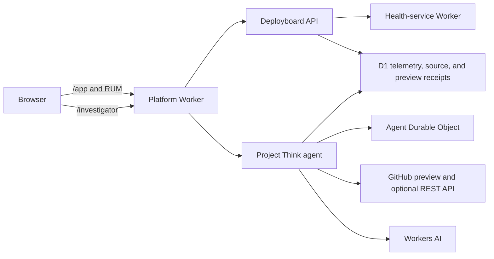

# Regression Surgeon — Implementation Plan

## 1. Product definition

Regression Surgeon is a Cloudflare-native agent that connects a measured UX latency regression to
backend traces, identifies the first bad deployment and its GitHub commit or pull request, and
prepares a minimal evidence-backed remediation behind a human approval boundary.

The demonstration path is deliberately narrow:

1. A configured incident identifies one measured baseline and degraded release pair.
2. The Project Think agent compares those releases.
3. It finds slow traces and inspects one representative trace.
4. It maps the degraded Worker version to an immutable Git commit and PR evidence or an explicit
   unknown.
5. It reads only allowlisted repository files at that commit.
6. It explains the likely cause, evidence, inference, confidence, and remaining uncertainty.
7. It prepares a validated one-file remediation preview with external writes disabled.

Deployboard can optionally generate bounded current-release samples to demonstrate telemetry
ingestion. Those samples do not select or modify the configured incident. A real draft PR is a
separate operator-enabled extension; it is not required for the credential-free reviewer contract.

## 2. Fixed architectural decisions

| Area | Decision |
| --- | --- |
| Hosting | Cloudflare Workers only |
| Agent harness | Project Think |
| Model | Workers AI through `workers-ai-provider` |
| Frontend | React SPA built with Vite |
| Server | Cloudflare Worker API |
| Agent state | Project Think's SQLite-backed Durable Object |
| Telemetry | Application-owned, measured telemetry stored in D1 |
| Repository | Single-package TypeScript repository with workspace-shaped domain directories |
| Development method | Strict test-driven development |
| Local runtime | Cloudflare Vite plugin, Miniflare, and `workerd` |
| Tool management | mise |
| Supported hosts | macOS and Linux, ARM64 and x64 |
| Supported shells | sh, Bash, Zsh, Fish, and Nu |
| Optional containers | Colima with Compose |
| GitHub runtime integration | Immutable deployment-seeded D1 source evidence by default; optional GitHub REST through constrained Worker tools |
| PR behavior | Validated preview by default; optional approved, guarded, idempotent draft PR |

## 3. Node and Workers runtime

The development toolchain uses Node.js 24.18.0:

```toml
node = "24.18.0"
```

Reasons:

- Project Think currently requires Node 24 or newer.
- Node 24 is an LTS release.
- Wrangler 4.110.0 requires Node 22 or newer.
- The deployed application does not run in Node. It runs in Cloudflare's `workerd` runtime.

Every Worker configuration pins:

```jsonc
{
  "compatibility_date": "2026-07-11",
  "compatibility_flags": ["nodejs_compat"]
}
```

The compatibility date is updated deliberately, never automatically. Cloudflare implements a subset of Node APIs, and some available imports remain non-functional stubs.

References:

- [Project Think getting started](https://developers.cloudflare.com/agents/harnesses/think/getting-started/)
- [Workers Node.js compatibility](https://developers.cloudflare.com/workers/runtime-apis/nodejs/)
- [Node.js release schedule](https://nodejs.org/en/about/previous-releases)

## 4. Repository layout

```text
.
├── apps/
│   └── web/
│       ├── src/
│       │   ├── deployboard/      # Deployboard UI and client
│       │   ├── investigator/     # Think chat UI
│       │   └── experience.ts     # Route-to-experience contract
│       └── index.html
│
├── workers/
│   ├── platform/
│   │   └── src/
│   │       ├── agent/            # Think model, evidence tools, and services
│   │       ├── api/              # Supervised application API
│   │       ├── github/           # Persisted source and optional GitHub REST adapters
│   │       ├── telemetry/        # D1 ingestion and queries
│   │       └── index.ts
│   │
│   └── health-service/
│       └── src/
│           └── index.ts          # Auxiliary dependency Worker
│
├── packages/
│   ├── contracts/                # Shared schemas and types
│   ├── telemetry/                # Browser/server instrumentation
│   └── test-fixtures/            # GitHub and model fixtures
│
├── migrations/
│   └── telemetry/
├── scripts/
│   ├── bootstrap                 # Shell-neutral POSIX setup entrypoint
│   ├── bootstrap-core.sh
│   ├── activate
│   ├── teardown
│   ├── container.ts
│   ├── doctor.ts
│   ├── e2e.ts
│   ├── agent-e2e.ts
│   └── scenario.ts
├── compose.yaml
├── Containerfile
├── mise.toml
├── mise.lock
├── pnpm-workspace.yaml
├── pnpm-lock.yaml
├── vite.config.ts
└── wrangler.jsonc
```

The platform Worker serves both experiences:

- `/app` — supervised Deployboard application
- `/investigator` — Regression Surgeon chat
- `/api/*` — supervised application and telemetry endpoints
- `/agents/*` — Project Think protocol

The health service runs as an auxiliary Worker connected through a service binding. This creates a real multi-Worker request path without requiring multiple public deployments for the MVP.

Cloudflare recommends running tightly coupled Workers through one development command because it provides the best binding compatibility. The Vite plugin supports this through `auxiliaryWorkers`.

Reference: [Developing with multiple Workers](https://developers.cloudflare.com/workers/local-development/multi-workers/)

## 5. Runtime architecture



## 6. mise toolchain

The initial `mise.toml` contract is:

```toml
min_version = "2026.6.14"

[settings]
lockfile = true

[tools]
node = "24.18.0"
wrangler = { version = "4.110.0", depends = ["node"] }
gh = "2.96.0"
shellcheck = "0.11.0"
shfmt = "3.13.1"
actionlint = "1.7.12"
"github:nushell/nushell" = "0.113.1"

# Optional container lane. These are not installed on unsupported hosts.
colima = { version = "0.10.3", os = ["macos", "linux"] }
docker-cli = { version = "29.6.1", os = ["macos", "linux"] }
docker-compose = { version = "5.3.1", os = ["macos", "linux"] }
```

Commit `mise.lock` with platform entries for:

- macOS ARM64
- macOS x64
- Linux ARM64
- Linux x64

mise owns external executables. The mise-managed Node runtime supplies Corepack, which provisions the exact `pnpm@10.34.5` declared by the root `packageManager` field inside the repository-local tool tree. This avoids an incomplete package-manager backend catalog while keeping every executable root under mise. pnpm owns source-linked JavaScript libraries such as React, Think, the Cloudflare Vite plugin, TypeScript, and Vitest.

The Cloudflare Vite plugin itself depends on Wrangler. The pnpm lockfile may therefore also contain Wrangler, but its version must match the mise-pinned 4.110.0.

References:

- [Installing mise](https://mise.jdx.dev/installing-mise.html)
- [mise lockfiles](https://mise.jdx.dev/dev-tools/mise-lock.html)

## 7. Shell-neutral bootstrap contract

Bootstrap supports only macOS and Linux on ARM64 and x64.

All supported shells use the same command:

```text
./scripts/bootstrap
```

The command must be run from the repository root. Each entrypoint verifies that `mise.toml` is present before continuing.

Bootstrap is executed, never sourced. It performs setup in its own POSIX process and cannot modify
the parent shell. The separate `activate` executable opens a project-scoped child shell or runs one
command with the project environment.

### 7.1 Isolation rules

Bootstrap will:

- Install mise into `.local/bin/mise`.
- Store mise-installed tools under the repository's `.local/` directory.
- Store mise cache and state under `.local/`.
- Add mise and its tools to `PATH` only in the launched project shell or command.
- Activate the repository toolchain only in the launched project shell or command.
- Never modify `.profile`, `.bashrc`, `.zshrc`, Fish configuration, or Nu configuration.
- Never install mise into `/usr/local/bin` or another system path.
- Never spawn a replacement login shell during bootstrap.
- Remain idempotent when executed repeatedly or nested through activation.

The shared bootstrap and activation entrypoints set repository-local paths before calling the
bootstrap core or launching the requested shell or command:

```text
MISE_INSTALL_PATH=.local/bin/mise
MISE_DATA_DIR=.local/share/mise
MISE_CACHE_DIR=.local/cache/mise
MISE_STATE_DIR=.local/state/mise
MISE_GLOBAL_CONFIG_FILE=.local/mise-global.toml
MISE_CONFIG_DIR=.local/config/mise
```

The entrypoints also add the user's normal global mise config to `MISE_IGNORED_CONFIG_PATHS`. This prevents unrelated personal tools or aliases from leaking into a repository bootstrap.

When the project shell or command exits, activation and environment changes disappear. Downloaded repository-local tools remain cached until teardown.

### 7.2 Bootstrap implementation

The common `bootstrap-core.sh` performs filesystem and installation work but does not attempt to alter the calling shell.

Both POSIX entrypoints expose the repository toolchain by prepending the repository's mise shims and
binary directory. They do not generate, evaluate, or source shell-specific activation code.
`bootstrap` may run an optional command after successful setup; `activate` runs an optional command
or opens the shell named by `SHELL`.

### 7.3 Consent behavior

The shared bootstrap core uses single-keystroke confirmations for:

- Installing mise locally
- Trusting the repository's mise configuration
- Installing pinned tools
- Installing pnpm dependencies
- Applying local D1 migrations
- Loading deterministic fixtures
- Running the build and local verification suite

Prompts default to yes and use the form:

```text
Install the repository-local mise toolchain? [Y/n]
```

The TTY reader must restore terminal state after every response and on interruption.

Bootstrap never prompts about shell profiles because persistent activation is forbidden.

### 7.4 Activation after bootstrap

Subsequent terminal sessions use the same lightweight activation command without repeating
installation:

```text
./scripts/activate
```

This opens a project-scoped child shell. A one-off command can instead run as
`./scripts/activate <command> [args...]`.

## 8. Teardown behavior

Default teardown removes only repository-owned state:

- Project Compose containers, network, and named volumes
- The named `polylane-take-home` Colima profile, if created by this project
- `.wrangler/state`
- `.local/run`
- Build output and coverage
- Generated fixture databases

It must not:

- Modify shell profiles
- Remove unrelated Colima profiles, containers, or volumes
- Delete `.dev.vars`
- Remove the repository-local mise installation unless explicitly requested

The explicit `--purge-toolchain` flag additionally removes the repository-local `.local` mise tools
and cache. Supplying that flag is the affirmative purge request; the default path preserves the
toolchain and `node_modules`.

Teardown does not attempt to edit the parent shell's environment. Exiting the project shell ends the
activation naturally.

## 9. mise tasks

Complex orchestration lives in cross-platform `.ts` files executed directly by the pinned Node 24
runtime rather than in shell-specific task bodies. These scripts use only erasable TypeScript syntax,
which Node can type-strip without a loader; `tsc --noEmit` remains the separate type-safety gate.

| Task | Purpose |
| --- | --- |
| `mise run doctor` | Verify versions, ports, configuration, credentials, and bindings |
| `mise run install` | Install pnpm dependencies |
| `mise run build` | Build the implemented web and Worker components |
| `mise run format` | Apply canonical formatting |
| `mise run format:check` | Verify formatting without modifying files |
| `mise run lint` | Run code, configuration, and shell linting with zero warnings |
| `mise run typecheck` | Run strict TypeScript checks |
| `mise run check` | Run every non-deployment CI gate once: doctor, container contract, formatting, linting, type-checking, tests, E2E, and build |
| `mise run test` | Run the full foundation, unit, integration, and Worker test suites |
| `mise run test:watch` | Run named ordinary and Worker Vitest projects in one selectable watch workspace |
| `mise run db:migrate` | Apply local D1 migrations |
| `mise run dev` | Run the complete native stack with a fake local model |
| `mise run dev:live` | Run locally with remote Workers AI |
| `mise run e2e` | Run credential-free deterministic end-to-end verification |
| `mise run container:up` | Start the optional Colima/Compose lane |
| `mise run container:down` | Stop project container resources |
| `mise run container:check` | Validate the Compose model without starting a VM |
| `mise run auth:cloudflare` | Run Cloudflare authentication and status checks |
| `mise run github:writes:secret` | Enter a scoped GitHub token directly through Wrangler's TTY prompt |
| `mise run github:writes:secret:delete` | Remove the scoped token from the Worker |
| `mise run deploy` | Apply remote migrations and deploy |
| `mise run deploy:refresh` | Redeploy only the investigator while preserving measured evidence |
| `mise run deploy:smoke` | Verify public routes, runtime, agent evidence, preview, and write posture |
| `mise run deploy:writes:enable` | Explicitly enable the guarded optional live-write posture |
| `mise run deploy:writes:disable` | Return the public runtime to write-disabled posture |
| `mise run deploy:reset` | Remove only the last measured release pair from remote D1 |
| `mise run teardown` | Remove repository-owned local state |

## 10. Local development strategy

### 10.1 Canonical native path

Use one Cloudflare Vite development server with:

- Platform Worker as the primary Worker
- Health service as an auxiliary Worker
- Local D1
- Local Durable Objects
- Static React assets
- Hot reload

Both Wrangler and the Cloudflare Vite plugin use Miniflare and `workerd`. Local bindings are simulated automatically.

Reference: [Cloudflare local development](https://developers.cloudflare.com/workers/local-development/)

### 10.2 Local model behavior

Workers AI bindings execute remotely even when Worker code runs locally. The project therefore supports two model modes:

- `fake` — deterministic AI SDK model for tests and credential-free E2E
- `workers-ai` — real Workers AI binding for interactive development and production

`mise run e2e` uses the fake model and GitHub fixtures. It exercises:

- Think's multi-step loop
- Tool calls and results
- Telemetry investigation
- Commit and PR correlation
- Structured evidence, inference, confidence, and unknowns

It never calls a live model or writes to GitHub. The same E2E now validates an evidence-rich draft-PR
preview, while rendered-browser verification covers the native approval request and continuation.

`mise run dev:live` uses Workers AI and requires Cloudflare authentication.

### 10.3 Optional Colima lane

Colima is never started by bootstrap. The user must explicitly run:

```text
mise run container:up
```

The task uses a named Colima profile:

```text
polylane-take-home
```

It starts the profile with `--activate=false`, addresses its socket directly, and therefore never
changes the user's active Docker context. The profile receives 4 GiB of memory for Vite plus
`workerd`, and the exact repository root is mounted explicitly so clones outside the home directory
remain visible to the VM. Repository markers distinguish a profile created by this project from one
that already existed. `container:down` preserves the profile and Linux-owned volumes for reuse; full
teardown removes volumes and deletes only a profile carrying valid project ownership evidence. Failed
starts retain their markers for deterministic recovery.

Compose runs the same mise task inside one Linux container. It is not a separate application architecture.

The container will:

- Install and checksum-verify mise 2026.6.14 in the container image.
- Install the locked Node runtime through mise.
- Install pnpm dependencies into Linux-owned volumes.
- Start the same Vite and `workerd` stack.
- Expose the same local URL.

Host `node_modules` must not be mounted into the container because `workerd` and related packages contain platform-specific binaries.

The native path remains the documented default. The Compose lane exists for Linux parity and clean-room verification.

## 11. Supervised application and intentional regression

Status: implemented in issue #6. Commit `cf25e52` is the real known-good concurrent release. The
issue #6 pull request introduces the sequential transition with the stated intent of reducing
simultaneous downstream pressure. Local scenario controls are available only when explicitly enabled
in fake mode, addressed through a loopback host, and presented with the fixed local key; live mode
disables them.

Deployboard displays health data for a collection of software services.

The initial implementation loads health statuses concurrently:

```ts
const statuses = await Promise.all(
  serviceIds.map((id) => healthService.getStatus(id)),
);
```

The intentional regression changes the behavior to sequential requests, framed as an attempt to reduce downstream request pressure:

```ts
const statuses = [];

for (const id of serviceIds) {
  statuses.push(await healthService.getStatus(id));
}
```

This produces:

- Increased `service_grid_ready_ms`
- Increased API wall time
- Repeated sequential health-service spans
- A clear first bad release
- A meaningful source diff and PR rationale

The expected surgical fix uses batching or bounded concurrency rather than blindly reverting the change.

The regression exists as a real commit associated with a real PR in repository history.

`mise run scenario:reseed` removes only the two controlled releases, sends 20 concurrent and 20
sequential interactions through the real local service binding, stores their measured D1 evidence,
then verifies a ready comparison and parent-aware slow-trace critical-path wall time.
`mise run scenario:reset` performs the scoped deletion independently. Neither operation writes an
agent conclusion or modifies unrelated telemetry.

## 12. Telemetry model

Primary D1 tables:

```text
releases
  release_id, git_sha, deployed_at_ms

ux_events
  event_id, interaction_id, trace_id, release_id,
  metric_name, duration_ms, outcome, recorded_at_ms

traces
  trace_id, interaction_id, release_id,
  started_at_ms, duration_ms, outcome

spans
  trace_id, span_id, parent_span_id, service_id,
  started_at_ms, duration_ms, status
```

Telemetry comes from measured application requests:

- Browser custom performance measurements
- Worker request timing
- Service-binding timing
- Status and error information
- Worker version metadata
- Git commit SHA

Native Workers observability is enabled in parallel, but D1 remains the agent's initial investigation source because it supports deterministic local reproduction and durable demo evidence.

## 13. Project Think agent

The implementation uses one typed, incident-scoped evidence receipt and five single-purpose tools.
It does not infer completion from prose or undifferentiated history.

Configure:

- Workers AI model through `workers-ai-provider`
- Maximum 16 tool steps per turn
- Evidence-oriented system prompt
- Tool result size limits
- Lifecycle logging
- Persistent conversation state
- Explicit confidence and unknowns in final reports

Evidence tools:

### `compare_releases`

- Compare the configured baseline and degraded releases over equivalent bounded windows.

### `find_slow_traces`

- Find bounded representative traces within the degraded release window.

### `inspect_trace`

- Inspect one selected trace, its parentage, and dependency timing.

### `inspect_release`

- Resolve Worker version to commit
- Find the associated pull request
- Return bounded commit and PR metadata

### `read_repo_files`

- Read files at a specific commit
- Enforce path, file-count, and byte limits

### `create_draft_pr`

- Remain unavailable until the same incident has a complete evidence receipt.
- Prepare and persist an exact bounded diff plus fingerprint.
- Require explicit approval of that fingerprint.
- Return a validated preview by default; optionally create or reuse one idempotent draft PR.

Every evidence result is explicitly `complete`, `insufficient`, or `error`. Truncated, null, empty,
mismatched, or invalid results do not complete a phase. The receipt cross-references the incident,
baseline and degraded releases, selected and inspected trace, immutable Git SHA, PR evidence or
unknown, allowlisted paths, and blob SHAs. The same receipt drives step policy, report references,
remediation eligibility, reviewer UI, and smoke verification. No tool accepts arbitrary SQL.

## 14. GitHub PR safety

The deployed Worker uses immutable deployment-seeded D1 source and preview receipts by default and
optional REST through `fetch`; it cannot invoke the mise-installed `gh` executable. The
credential-free investigation and write-disabled preview perform no GitHub request.

`gh` is used for repository setup, authentication checks, and operator workflows.

The PR tool enforces:

- One configured repository
- Draft PRs only
- Explicit Project Think approval
- Expected base SHA and blob SHA
- Allowlisted source paths
- Maximum file and changed-line limits
- No `.github`, secrets, agent code, or deployment configuration changes
- Telemetry evidence IDs in the PR body
- Incident-fingerprint idempotency
- Deterministic branch recovery after uncertain write responses
- `GITHUB_WRITE_ENABLED=false` by default
- No merge capability

Local execution returns a validated PR preview after the same server-side proposal checks and never
constructs a write-capable adapter. Live mode requires a scoped `GITHUB_TOKEN`; production write
behavior additionally requires `GITHUB_WRITE_ENABLED=true` and explicit approval of the action.

## 15. Strict TDD and test strategy

Test-driven development is the required implementation method, not an optional final verification phase.

Every behavior change follows this loop:

1. State the observable behavior or invariant being added or repaired.
2. Add the smallest test that expresses it.
3. Run the targeted test and confirm that it fails for the expected reason.
4. Add the minimum production code needed to make it pass.
5. Run the targeted test and confirm that it passes.
6. Refactor while keeping the test green.
7. Run the affected package suite and repository quality gates.

Bug fixes always begin with a regression test. Production behavior must not be written speculatively ahead of its failing test. Documentation-only changes and generated artifacts are exempt from the red step, but still require their applicable validation commands.

Coverage percentage is not the target. The target is complete protection of meaningful product invariants, boundary behavior, failure behavior, and security decisions. Tests should observe public behavior and structured outputs rather than private implementation details.

### 15.1 Meaningful product invariants

#### Supervised application

- Concurrent health loading preserves service identity and output ordering.
- A partial dependency failure produces a bounded partial result rather than losing the entire dashboard.
- The intentionally sequential implementation produces a measurable regression fixture.
- UX measurements are emitted once per completed interaction.
- Trace and release identifiers flow from server response to browser telemetry.

#### Telemetry

- Release comparisons use equivalent windows and require a minimum sample count.
- Percentiles, error rates, and deltas are correct at empty, singleton, and boundary-sized datasets.
- Clock ordering and duration units are consistent.
- Trace trees preserve parent-child relationships and expose bounded missing-parent and cycle
  diagnostics.
- Critical-path calculation selects deterministic causal contributors: parallel siblings compete,
  sequential siblings can both contribute, nested ancestry remains visible, and fork/join ties are
  stable.
- Critical-path span IDs and `wallTimeMs` describe the same selected path; merged interval coverage
  is not mislabeled as a path.
- Queries enforce time-window, row-count, and result-size limits.
- No tool accepts arbitrary SQL.

#### Release and repository correlation

- Worker version metadata resolves to exactly one expected Git SHA.
- The first bad release is selected from measured evidence rather than commit order alone.
- A commit maps to its originating PR when GitHub returns one and degrades safely when none exists.
- Repository reads remain pinned to the requested immutable commit.
- Path traversal, oversized files, and disallowed paths are rejected.

#### Agent behavior

- The deterministic model drives a real multi-step Think tool loop.
- The agent cannot produce a fix before collecting telemetry and release evidence.
- Tool failures become bounded model-visible errors without corrupting persisted conversation state.
- Step limits terminate runaway behavior.
- Tool results are truncated deterministically before entering model context.
- Final structured reports distinguish evidence, inference, confidence, and unknowns.
- Refresh or reconnection preserves the committed conversation and does not duplicate tool effects.

Tests should assert structured messages, tool calls, state transitions, and evidence references. They should not assert incidental prose from a live model.

#### Draft PR safety

- GitHub writes are disabled by default.
- A write cannot occur without explicit approval.
- Only the configured repository and allowlisted source paths can change.
- Base SHA and blob SHA checks reject stale proposals.
- File-count, byte-count, and changed-line budgets are enforced server-side.
- `.github`, secrets, agent code, and deployment configuration remain immutable.
- Repeated execution for one incident returns the existing PR.
- Failed GitHub operations do not leave an untracked partial success.
- PR bodies contain the evidence IDs and validation plan used to justify the fix.

#### Bootstrap and local operations

- Bootstrap is idempotent when launched from every supported shell.
- It changes only its process environment and repository-local files.
- It never writes to a shell profile or system installation path.
- A declined prompt performs no associated mutation.
- TTY settings are restored after acceptance, rejection, failure, and interruption.
- Teardown removes only resources carrying the project's identity.
- Native and container entrypoints invoke the same underlying tasks.

### 15.2 Test layers

#### Unit tests

- Telemetry aggregation and release comparison
- Trace waterfall and critical-path calculation
- Git commit-to-PR resolution
- Repository path allowlisting
- Patch size and stale-blob validation
- Incident fingerprint and PR idempotency
- Prompt-independent report and evidence structures

#### Worker integration tests

- D1 migrations and queries under the Workers test runtime
- Platform-to-health-service binding calls
- Think tool schemas and error behavior
- Agent state persistence and reconnection
- Approval and write-disable enforcement

#### Shell contract tests

- The shared POSIX bootstrap, activation, and teardown entrypoints in isolated temporary homes
- sh, Bash, Zsh, Fish, and Nu launch the same lifecycle executables
- Project-shell and command-scoped activation
- Profile files remain byte-for-byte unchanged
- Bootstrap and teardown remain idempotent

#### Container contract tests

- The resolved Compose model contains exactly one application service.
- Linux-owned volumes cover dependencies, mise runtime data, and Worker state.
- Up/down are repeatable and never change the active Docker context.
- Pre-existing profiles are preserved, while project-created profiles have explicit ownership.
- Partial starts retain enough evidence for a later scoped teardown.

#### End-to-end verification

The deterministic fake model follows a realistic investigation path:

1. Query release metrics.
2. Inspect representative slow traces.
3. Inspect the first bad release.
4. Read the relevant implementation.
5. Produce a structured evidence report.

The E2E runner starts the actual local Worker stack, waits for readiness, loads measured scenario
evidence, submits the investigation prompt through a local-only Durable Object RPC, observes the five
tool events, and validates the trace-, commit-, and PR-backed report. Browser verification separately
proves the rendered timeline and reconnect behavior. The E2E then validates a same-trace remediation
preview with zero external writes. Rendered-browser verification proves that the action parks before
execution, exposes one file and its evidence trace, and continues only after explicit approval.

End-to-end tests must not depend on a live LLM, GitHub writes, wall-clock sleeps, unseeded randomness, or shared mutable remote data.

### 15.3 Linting and formatting gates

- TypeScript uses strict compiler settings with no unchecked escape hatches.
- JavaScript, TypeScript, JSON, and JSONC use one canonical formatter and linter configuration.
- Markdown is linted for structural consistency.
- POSIX shell is checked with ShellCheck and formatted with `shfmt`.
- Fish and Nu contract tests launch the same POSIX lifecycle entrypoints.
- Lint warnings fail CI; warning budgets are not allowed.
- Suppressions must be narrow, explained inline, and protected by a test when they affect behavior.
- Generated files are checked for reproducibility and drift.

The root `AGENTS.md` is the authoritative contributor contract for TDD, quality gates, and completion criteria.

## 16. Implementation phases

### Phase 1 — Foundation

Status: complete in issue #2. The real repository-local bootstrap, doctor, build, aggregate checks,
and foundation E2E suite pass on macOS ARM64. The macOS/Linux CI matrix supplies cross-platform
evidence that every supported shell launches the shared POSIX lifecycle entrypoints.

- Initialize the pnpm workspace.
- Add mise configuration and lockfile.
- Add the root `AGENTS.md` contributor contract.
- Implement shell-neutral POSIX bootstrap, activation, and teardown entrypoints.
- Implement doctor, teardown, and build tasks.
- Add formatting, linting, strict type-checking, and test tasks.
- Add initial CI verification.

Acceptance criteria:

- A clean checkout can install and build through mise on macOS/Linux.
- No bootstrap path modifies shell profiles or system installation paths.
- Activation disappears when the terminal session ends.
- A deliberately failing test proves the red phase before the first production behavior is implemented.
- `mise run check` passes with zero warnings.

### Phase 2 — Cloudflare skeleton

Status: complete in issue #3. One Cloudflare Vite development URL now serves the React shell, the
platform Worker, a SQLite-backed Project Think Durable Object, local D1, version metadata, and the
auxiliary health-service Worker. Fake mode is credential-free and omits the remote AI binding;
`wrangler.live.jsonc` is the explicit Workers AI configuration.

- Add the React/Vite application.
- Add the platform Worker.
- Add the Think Durable Object.
- Add the Workers AI binding.
- Add the auxiliary health-service Worker.
- Configure local D1 and version metadata.

Acceptance criteria:

- `/app` and `/investigator` load from one local URL.
- The platform Worker can call the health-service binding.
- Think persists a local chat session.

### Phase 3 — Supervised application

Status: complete in issues #4 through #6. The known-good commit fans out to three concurrent
auxiliary Worker checks. The issue #6 transition intentionally serializes those checks, preserves
stable service order and bounded partial failures, and records the resulting browser, request, span,
release, and Git evidence.

- Build Deployboard.
- Implement concurrent health loading.
- Add browser performance measurement.
- Add the intentional regression as a separate commit and PR.

Acceptance criteria:

- The regression produces a visible and repeatable latency increase.
- Both browser and server measurements carry release metadata.

### Phase 4 — Telemetry

Status: historically delivered in issues #5 and #6, with retry/attribution integrity hardened in
issue #40 and parent-aware trace semantics implemented in issue #41. D1 stores immutable releases,
UX events, traces, and spans from real application requests. Exact retries are idempotent, while
reused trace, span, or interaction identifiers with different immutable data abort the complete
write. Every UX event must match the release and interaction of its referenced trace. Fixed query
methods enforce time, row, and serialized-result bounds; comparisons use equivalent release-relative
windows and minimum samples. Trace detail reports a deterministic parent-aware path and its wall
time, excludes malformed components with explicit diagnostics, and never labels merged interval
coverage as a path.

- Add D1 migrations.
- Record UX events, traces, spans, and releases.
- Implement bounded telemetry queries.
- Add baseline and regression traffic generation.

Acceptance criteria:

- A deterministic query identifies the first bad release.
- Representative traces identify the sequential dependency calls.

### Phase 5 — Read-only agent

Status: historically delivered in issues #7 and #8, with incident identity and evidence provenance
hardened in issues #38 and #39. The bounded connector resolves release evidence to immutable commits
and associated PR metadata. Project Think exposes five single-purpose evidence tools, enforces 16
tool steps and deterministic result truncation, and persists one validated incident-scoped receipt.
Only the expected tool's sufficient, cross-referenced output completes each phase. The final report
cites that receipt and separates evidence, inference, confidence, and unknowns.

- Add `compare_releases`, `find_slow_traces`, `inspect_trace`, `inspect_release`, and
  `read_repo_files`.
- Configure prompt, step limits, and tool-event UI.
- Add deterministic fake-model E2E.

Acceptance criteria:

- The agent independently reaches the correct commit and PR.
- Its report cites telemetry and repository evidence.
- Tool failures produce bounded, understandable recovery behavior.

### Phase 6 — Draft PR

Status: historically delivered in issue #9, with receipt binding implemented in issue #39.
`create_draft_pr` is a native Project Think action with explicit high-risk approval, a narrow
permission, and preview/write-scoped incident idempotency. The
server-side service validates configured repository and path, matching regression/base SHA, current
blob SHA, replacement byte and line bounds, changed-line count, draft-only output, evidence-rich body,
and deterministic branch state. Fake mode always returns a validated preview without network access.
Credential-free live release inspection reads only the deployment-seeded D1 receipt for
`workers/platform/src/api/health.ts`. Deployment derives it from configured PR #19's immutable local
base/head/regression Git objects, requires exact head/regression bytes and Git blob identity, and
requires the base source to differ before tying it to the measured degraded release. Runtime commit
subject/date are evidenced; author, PR title/author/base/merge, and diff-count metadata remain
explicitly partial. Deployment also validates and persists the deployed-main source only when its
bytes/blob equal the evidenced regression source. Write-disabled preview validation reads only those
two immutable D1 refs. Tree metadata remains mandatory for writes. A normalized scoped token selects
the bounded REST adapter, is required before writes can
be enabled, and remains write-disabled until the explicit flag is set. Existing PRs are reused, and
uncertain branch or PR responses return deterministic recoverable state without creating another
branch. Recovery accepts only a branch exactly one commit ahead of the evidenced base with exactly the
approved file changed. No merge endpoint or tool exists. The action is unavailable until the same
incident's receipt is complete. The receipt then prepares and persists the exact one-file replacement
and stable fingerprint; authorization rejects a changed fingerprint or proposal, while repository
branch identity remains stable per incident.

- Add guarded PR proposal creation.
- Add Project Think approval interaction.
- Add GitHub REST write adapter.
- Add idempotency and path/diff validation.
- Add CI checks for generated PRs.

Acceptance criteria:

- One approved investigation creates or reuses a safe draft PR.
- Repeated runs do not generate duplicate PRs.
- Disallowed changes are rejected server-side.

### Phase 7 — Reproducible local delivery

Status: complete in issue #10. Bootstrap now offers consented D1 migration, deterministic fixture,
build, and full credential-free verification stages. The native `mise run dev` and `mise run e2e`
paths remain canonical. The optional Compose model runs the same dev task in one Linux service, uses
named volumes for every platform-specific or generated path, and is validated on all four CI host
pairs. A dedicated Colima profile is addressed without changing Docker context; runtime and ownership
markers make repeated down, full teardown, pre-existing-profile preservation, and partial-start
recovery deterministic.

- Complete bootstrap through migration, fixtures, build, and local E2E.
- Add one-service Colima/Compose parity.
- Add lifecycle, isolation, failure-recovery, and Compose-model tests.
- Document native and optional-container operations.

Acceptance criteria:

- Native setup remains the primary, credential-free path.
- Container setup invokes the same `mise run dev` behavior.
- Host `node_modules` and generated Worker state never enter the Linux container.
- Reset and teardown affect only resources carrying verified project identity.

### Phase 8 — Deployment and evidence

Status: historically delivered in issue #11. The deployment task creates or reuses the named D1 database, applies
remote migrations, measures 20 concurrent and 20 sequential interactions under distinct Cloudflare
version IDs, and deploys the public GLM 4.7 Flash Project Think investigator. The final configuration
injects the exact evidence IDs and bounded degraded trace window. A keyed smoke invokes the real
Durable Object and Workers AI model, checks evidence events and a structured report, validates a
remediation preview, and proves GitHub writes remain disabled. Issue #42 replaces name/count checks
with one shared structured receipt that validates all five phases, cross-references, report sections,
remediation fingerprint and change counts, and a zero-write result in local and deployed smoke.
Issue #59 makes every measured health and telemetry POST one-shot: transport or response failure
stops deployment with sample evidence instead of replaying an endpoint that may already have taken
effect. Each measured interaction identifier includes the immutable Worker version so later
deployments cannot collide with historical sample ordinals. Side-effect-free runtime identity
polling remains isolated from those request paths. A narrow readiness route exposes only immutable
version/Git attribution so deployment can wait for the exact baseline or degraded version at the
public edge for three consecutive observations before starting any measured POST. Deployment health
also carries the expected release through a narrow media type so an older or stale edge rejects the
request before dependencies or persistence. Issue #64 makes the keyed smoke classify the fixed
five-phase receipt before remediation: incomplete evidence returns only bounded phase/status
diagnostics plus a whitelisted reason code for errors, deployment surfaces the non-complete phases,
and preview is never invoked. Credential-free live evidence uses one immutable D1 source receipt
seeded from configured PR #19's local base/head/regression Git objects and tied to the measured
degraded release. The runtime performs no GitHub request for release/source evidence; incomplete
author, PR, and diff-count metadata remains explicit rather than fabricated. Its write-disabled
remediation preview reads the companion deployed-main D1 receipt and validates the allowlisted file
at immutable SHAs. Issue #71 binds
the one configured incident to its exact `workers/platform/src/api/health.ts` remediation source
rather than treating the first allowlisted commit change as the target. Issue #73 makes the configured
release pair, comparison window, degraded trace window and limit, and degraded release lookup
server-authoritative so model-generated selectors cannot change or block the one incident. Issue #68
applies the same consecutive exact-version readiness gate to the recorded secret-bearing investigator
before every keyed smoke, preventing a prior no-key edge from receiving executable verification.
Issue #75 distinguishes an invalid receipt shape from missing preparation using only whitelisted
contract-surface names, without returning values, validation messages, secrets, or model prose.
Issue #77 replaces the unavailable credential-free commit-patch origin with configured PR #19's
bounded patch and exact immutable `health.ts` source equality; it does not generalize PR discovery,
repository paths, or release selection.
Issue #79 caps each failed evidence phase at two persisted attempts and removes all evidence tools
after that retry is exhausted, so a model can report bounded uncertainty but cannot produce a third
attempt or prepare remediation.
Issue #81 replaces the Cloudflare-unavailable PR patch transport with a raw-only proof over the
configured PR ref, immutable base/head, regression SHA, and exact `health.ts` bytes/blob identities.
Issue #83 supersedes that still-unreachable public transport with a deployment-seeded immutable D1
receipt derived from the same local Git proof; the credential-free runtime reads only that receipt.
Issue #85 removes the final public GitHub dependency from the write-disabled preview by seeding a
companion deployed-main source receipt that must equal the evidenced source by bytes and blob.
Issue #87 adds a smoke-key-protected, GET-only evidence-readiness gate after remote migration and
deployment. It polls only configured D1 comparison/trace/source/preview reads on 404/503 and cannot
call Workers AI, remediation, GitHub, health, or telemetry writes; the executable smoke stays
single-shot.
Issue #89 classifies the remaining post-evidence smoke boundary: preview failure exposes only one
whitelisted remediation code, while final cross-reference failure exposes only a fixed invalid
verification code. Exception text, source, model prose, identifiers, and credentials remain private.
Issue #91 keeps that final verification structural: evidence cross-references come from the validated
persisted receipt, while live model prose must supply the four report sections without repeating
machine identifiers verbatim.
Issue #93 binds trace inspection to the representative trace already selected and persisted by the
receipt. Model-generated trace identifiers are ignored, and the returned detail must still match the
receipt selection and configured degraded release.
Issue #95 extends only the protected smoke route's pre-execution 404 handoff to the same bounded
one-minute propagation horizon as deployment readiness. Every response that could follow execution
and every ambiguous transport failure remain single-shot.
Issue #97 classifies the remaining final-verification mismatch with only seven whitelisted contract
surface names. It preserves the fixed error code and excludes values, identifiers, source, exception
text, model prose, and credentials.
Issue #99 completes the server-authoritative selector boundary across all five configured evidence
tools. Model arguments are stripped before execution; runtime configuration supplies release/window
selectors, and the persisted receipt supplies trace and source commit/path selectors.
Issue #101 distinguishes a missing receipt-backed selector (`invalid-input`) from an evidence-service
failure (`unavailable`) without exposing values or exception text. A real Durable Object regression
also proves the current-step receipt reaches the immediately following trace tool locally.
Issue #103 closes the readiness execution-boundary gap exposed by the exact merged #101 deployment.
The keyed GET-only readiness probe now executes all configured D1 checks through the same named
Durable Object session used by the following one-shot smoke, without starting Workers AI or any
write-capable path.

- Create the remote D1 database.
- Deploy the good version and generate baseline traffic.
- Deploy the regression and generate incident traffic.
- Keep GitHub writes off by default; select live reads only when a scoped token is supplied.
- Attempt each measured health and telemetry POST exactly once and fail visibly on any error.
- Scope each deployment interaction identifier to its immutable Worker version and sample ordinal.
- Poll exact public edge version/Git readiness before starting either measured sequence.
- Reject stale deployment health before dependencies or trace persistence without retrying it.
- Deploy the public investigator.
- Perform the complete reviewer walkthrough.

Acceptance criteria:

- The public URL demonstrates symptom → trace → commit/PR → validated draft-fix preview.
- The demo requires no reviewer login.
- The README documents recovery if telemetry or the PR needs resetting.

### Phase 9 — Release readiness

Status: historically complete for v1 in issue #12. A clean macOS ARM64 worktree installed the repository-local toolchain
through the documented shell-neutral bootstrap, applied migrations, regenerated measured evidence, and
passed aggregate checks, build, and full local E2E. The public no-login routes and deployed keyed
smoke were reverified. README, wiki, plan, milestone dependencies, instructions, skills, limitations,
and evidence were reconciled.

- Re-run a native clean-room bootstrap and the public reviewer walkthrough.
- Reconcile README, wiki, implementation plan, issues, blockers, instructions, and skills.
- Publish limitations, recovery guidance, and final verification evidence.

Acceptance criteria:

- Every documented command and walkthrough matches the delivered artifact.
- All local and deployed gates pass, and the tracking issue can close with linked evidence.

### Phase 10 — Interactive demo UX

Status: complete in issue #25 and PR #26. Deployboard now offers fixed batches of 5, 10, or 20
measured interactions. The client rejects other counts before I/O, runs one health interaction at a time,
waits for each UX telemetry write to be acknowledged, exposes progress, and stops visibly on the
first failed sample. Refresh and generation share one in-flight guard, while the latest successful
sample keeps its interaction, trace, and release evidence visible.

The v1.1 interface was deployed publicly and passed its historical keyed Workers AI smoke with
runtime attribution, a structured report, a validated remediation preview, and GitHub writes off.
Mutable version IDs and latency snapshots belong in the dated release record rather than this plan.

The investigator is mounted alongside Deployboard as a bottom-corner support widget. A floating
launcher carries numeric attention and availability badges; its accessible dialog can collapse and
reopen without unmounting the Project Think session. `/investigator` deep-links to the same product
with the widget open. The desktop dialog is bounded, the mobile dialog fills the viewport, and the
composer retains full-width 44px controls. Assistant reports render as safe GitHub-flavored Markdown,
raw HTML stays inert, and user requests remain literal.

- Generate a bounded, acknowledged batch of real current-release metrics.
- Expose progress, failure, and latest trace/release evidence without overlapping work.
- Present the durable investigator as an accessible collapsible support widget.
- Render generated report structure, lists, links, code, and tables semantically.
- Keep model-provided raw HTML inert and user-authored requests literal.

Acceptance criteria:

- Only 5, 10, or 20 sequential samples are accepted, and progress advances only after telemetry
  acknowledgement.
- The support launcher, badges, dialog, collapse action, and direct link remain accessible and keep
  the agent mounted.
- Generated reports expose semantic Markdown without arbitrary HTML injection.
- At 390px, the dialog fills the viewport and the submit button is full-width and at least 44px tall.
- Focused UI tests, the complete local E2E, aggregate quality gates, container contract, and build
  pass.

### Phase 11 — Live investigator recovery and header simplification

Status: implementation merged through PR #37. Empty credentials stay on the no-write path, failed
persisted turns can retry, the redundant route pills are removed, Workers fetch receiver handling is
covered, and a bounded step policy forces missing evidence operations with one retry. The durable
remaining criterion in issue #27 is one credential-free public browser turn against the v1.2
structured receipt; issue #42 is its native blocker.

Close issue #27 and milestone 2 only after the structured deployed smoke and real browser turn
complete all required evidence phases with an unchanged write-disabled posture.

The investigator is already mounted as a support widget on both product routes, so the separate
Deployboard and Investigator route pills in the header are redundant. Remove those pills while
retaining the Regression Surgeon brand link and the `/app` collapsed and `/investigator` expanded
direct-link contracts.

Acceptance criteria:

- Empty and whitespace-only GitHub tokens are normalized as absent; live evidence and write-disabled
  preview use only the bounded D1 receipts.
- Write-enabled mode rejects missing, empty, and whitespace-only tokens.
- A failed turn permits a new explicit submission while submitted and streaming turns remain locked.
- System and programmatic investigation prompts explicitly require release comparison, slow-trace
  search, representative-trace inspection, degraded-release inspection, and allowlisted source
  reading before a final report.
- Both live GitHub adapters invoke the Workers fetch function without changing its receiver.
- The Project Think step policy forces the ordered evidence capabilities, restores persisted phase,
  does not double-count a tool call, and permits a low-confidence final report after two bounded
  failures rather than looping.
- A real public browser message completes that evidence-tool chain and produces an assistant response.
- The top-right route pills are absent without changing either public route contract.
- Full local gates, deployed smoke, responsive browser verification, and project-system alignment pass.

### Phase 12 — Explicit guarded draft-PR write enablement

Status: optional operator extension in unmilestoned issue #30. Implementation and fail-closed
refinements merged through PR #36. The draft-PR action, approval UI, bounded GitHub adapter, and
idempotent recovery are implemented. The operator workflow keeps ordinary deployment write-disabled,
accepts a fine-grained token only through pinned Wrangler's TTY secret prompt, and requires a
separate explicit deployment command to enable writes. A real GitHub write is not a v1.2
review-readiness requirement.

Enabling production writes must not make the keyed deployment smoke write-capable. Smoke continues
to construct a preview-scoped remediation service, while a real browser turn can reach the
write-scoped action only after Project Think requests and receives explicit approval. Disabling
writes must be equally explicit and preserve the measured evidence pair.

The regression commit remains the immutable incident anchor even after `main` advances. Before a
live write, the service reads the allowlisted file at both the evidenced commit and current base. It
may build the one-file commit on the current base tree only when both immutable blob and content are
unchanged; otherwise it fails stale rather than overwriting newer source.

Acceptance criteria:

- Normal deploy and refresh tasks always set `GITHUB_WRITE_ENABLED=false`.
- Token provisioning never reads `gh`, accepts a token argument, prints the token, or writes it to a
  repository-local file.
- Write enablement fails closed unless Cloudflare reports the exact `GITHUB_TOKEN` secret binding.
- Enable and disable preserve measured evidence, record the expected posture, and verify runtime
  attribution.
- Any enable-path failure after deployment begins automatically redeploys and independently verifies
  the write-disabled posture; a rollback failure preserves both errors.
- Runtime attribution allows at least 60 seconds of bounded edge propagation before declaring a
  write-disabled rollback unverifiable.
- Keyed smoke retries only the pre-execution 404 that can occur while the rotated smoke secret
  propagates; any response that may follow endpoint execution is returned immediately and never
  duplicated.
- Measured health and telemetry requests never retry after a transport failure or HTTP response.
- Keyed smoke remains a zero-write preview in both postures.
- Advanced repository state is accepted only when the allowlisted evidenced blob is unchanged at the
  current base.
- Only a real approved browser action may create or reuse one bounded draft PR; no merge capability
  exists.

### Phase 13 — Reviewer-ready evidence contract and simplification

Status: in progress in the
[v1.2 milestone](https://github.com/alexlopashev/cloudflare-agents-demo/milestone/3), coordinated by
[issue #48](https://github.com/alexlopashev/cloudflare-agents-demo/issues/48). Completion means a
credential-free measured investigation and validated write-disabled remediation preview. Live
GitHub write proof remains the optional operator workflow in issue #30.

Work packages:

- Incident identity is explicit and validated across runtime metadata, persisted investigation
  state, bounded evidence tools, structured reports, remediation preparation, fixtures, and deploy
  state; metric generation is labeled and enforced as ingestion-only (#38).
- Inferred tool-history completion is replaced by one persisted typed evidence receipt; remediation
  is gated on its exact prepared fingerprint and incident-stable branch identity (#39).
- Reject conflicting telemetry retries and cross-release attribution atomically (#40, implemented).
- Implement truthful, parent-aware trace-path semantics (#41, implemented).
- Make targeted tests, watch mode, aggregate checks, reconnection, and remote smoke prove the same
  structured contract (#42, implemented).
- Make the first-run UX direct, honest, accessible, and explicit about preview versus live writes
  (#43, implemented and browser-verified at desktop and 390px widths).
- Remove test-only runtime composition and normalize external configuration once (#44, implemented).
- Keep executable deployment traffic one-shot and make public edge handoff release-safe (#59,
  implemented).
- Diagnose incomplete live evidence with bounded phase statuses before remediation, then restore the
  exact five-phase public smoke (#64, diagnostic implemented; live recovery in progress).
- Bind source selection and server-authoritative evidence selectors, expose bounded invalid receipt
  diagnostics, and prove configured PR provenance by exact immutable source equality (#71, #73, #75,
  and #77; implementation complete pending the public smoke).
- Enforce the one-retry evidence limit in both receipt persistence and step tool availability (#79,
  implementation complete pending the public smoke).
- Replace the unavailable PR patch transport with the configured raw PR source proof (#81,
  implementation complete pending the public smoke).
- Replace the still-unreachable public source transport with a deployment-seeded immutable D1 receipt
  (#83, implementation complete pending the public smoke).
- Remove the final public preview transport with a companion immutable deployed-main D1 receipt (#85,
  implementation complete pending the public smoke).
- Gate the one executable public smoke on side-effect-free configured D1 evidence readiness (#87,
  implementation complete pending the public smoke).
- Bound post-evidence preview and final-verification smoke failures without exposing private values
  (#89, implementation complete pending the public smoke).
- Validate public smoke cross-references from the structured receipt instead of incidental live prose
  (#91, implementation complete pending the public smoke).
- Keep public trace inspection on the receipt-selected, readiness-proven evidence path (#93,
  implementation complete pending the public smoke).
- Bound rotated smoke-key 404 handoff without replaying executable responses (#95, implementation
  complete pending the public smoke).
- Classify final verification only by bounded whitelisted contract surfaces (#97, implementation
  complete pending the public smoke).
- Make all configured evidence arguments server-authoritative and immune to model selector shape
  (#99, implementation complete pending the public smoke).
- Classify receipt-selector absence separately from evidence-source unavailability (#101,
  implementation complete pending the public smoke).
- Prove configured D1 readiness in the exact named agent session before the one executable smoke
  (#103, implementation complete pending the public smoke).
- Complete clean-room release verification and project-system alignment (#45).

Acceptance criteria:

- A new investigation cannot reuse evidence from a previous incident or from user-authored prose.
- Only validated, cross-referenced complete results advance a phase; insufficient, truncated, null,
  empty, mismatched, and failed results remain visibly incomplete.
- Remediation is unavailable until all five evidence phases complete for the same incident.
- Approval displays and authorizes the actual bounded diff, rationale, counts, evidence references,
  fingerprint, and current write posture.
- Exact telemetry retries are no-ops; conflicting identifier reuse and cross-release attribution
  fail atomically.
- Trace-path output follows parentage and deterministic fork/join semantics.
- Missing, empty, and whitespace-only credentials are normalized once at composition.
- Targeted tests select only compatible suites, watch mode covers Worker behavior, and `mise run
  check` aggregates every non-deployment CI gate.
- Local and remote smoke validate one structured receipt with all five phases, required report
  sections, and a zero-write preview.
- The metric generator is visibly optional ingestion and is never presented as the incident source.
- The production Worker contains no test model or test-fixture implementation.
- README, wiki, release record, plan, issues, dependencies, instructions, and repository metadata
  describe the same reviewer journey.

## 17. Scope gates

Implement in this order:

1. Working supervised regression
2. Measured telemetry
3. Correct read-only investigation
4. Guarded draft PR
5. Reproducible local delivery
6. Public deployment
7. Release-readiness reconciliation
8. Post-v1 metric generation and support-widget polish
9. Reviewer-ready evidence integrity, truthful UX, and exact verification

Explicit non-goals:

- Windows or PowerShell support
- Persistent shell activation
- System-wide tool installation
- Arbitrary repository onboarding
- OAuth
- Multiple telemetry providers
- Sub-agents
- Cloudflare Workflows
- Automated merging
- Automated production rollback
- General-purpose code editing
- Full native Workers Observability ingestion

## 18. Reviewer walkthrough

The intended five-minute demonstration is:

1. Open the public application.
2. Optionally generate five current-release samples to demonstrate measured telemetry ingestion.
3. Open Regression Investigator and select **Investigate the seeded latency regression**.
4. Watch the five incident-scoped evidence phases complete for the configured measured release pair.
5. Review its Markdown-formatted evidence, inference, confidence, and unknowns, including the first
   bad commit and source PR.
6. Inspect the exact bounded-concurrency diff, evidence references, fingerprint, and changed-line
   counts.
7. Verify that the runtime is write-disabled and the result is a validated preview with zero
   external writes.
8. Explain that live draft-PR creation uses the same bounded proposal but is a separate optional
   operator workflow.

## 19. Project-system alignment

The implementation plan, GitHub milestone and issue dependency graph, wiki, README, `AGENTS.md`, and repository-local skills form one project system.

After every meaningful change:

1. Assess whether product behavior, architecture, interfaces, data, security, operations, workflow, delivery scope, or sequencing changed.
2. Update the implementation plan when the intended or implemented direction changed.
3. Update affected issue purpose, scope, non-goals, acceptance criteria, milestone assignment, and native blocked-by relations.
4. Update the wiki and README for human readers when the product, architecture, roadmap, setup, or operations changed.
5. Update agent instructions and reusable skills when contributor workflow or safety constraints changed.
6. Run the applicable document, issue, wiki, skill, test, lint, type-check, and build validations.
7. Record which surfaces were assessed and why unchanged surfaces remain correct.

Every delivery issue contains this alignment checklist and cannot close until it is satisfied. The repository-local `align-project-system` skill is the procedural source for the assessment.

Historical delivery is recorded in the
[v1 milestone](https://github.com/alexlopashev/cloudflare-agents-demo/milestone/1). Active hardening is
tracked in the [v1.2 milestone](https://github.com/alexlopashev/cloudflare-agents-demo/milestone/3)
under [issue #48](https://github.com/alexlopashev/cloudflare-agents-demo/issues/48). The optional live
GitHub write remains in [issue #30](https://github.com/alexlopashev/cloudflare-agents-demo/issues/30).
Native GitHub blocked-by relations, not checklist ordering alone, define the actionable graph.
