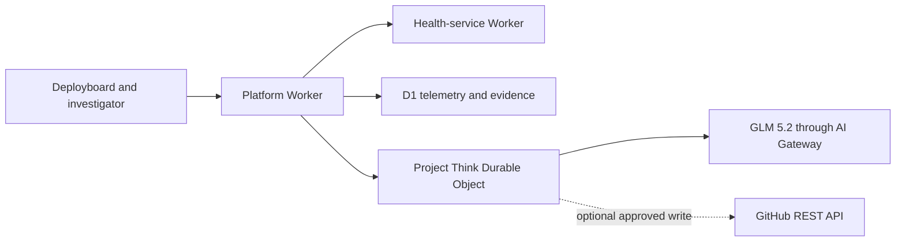

# Regression Surgeon

Regression Surgeon is a Cloudflare-native agent that traces a measured UX latency regression from
release telemetry to an immutable Git commit and prepares a bounded remediation preview. The public
demo is credential-free and write-disabled; a real draft PR is an optional, explicitly enabled
operator workflow.

- [Open the public demo](https://regression-surgeon-platform.alexlopashev.workers.dev/app)
- [Read the current implementation plan](IMPLEMENTATION_PLAN.md)
- [Review dated delivery evidence](RELEASE_READINESS.md)
- [Browse the project wiki](https://github.com/alexlopashev/cloudflare-agents-demo/wiki)

## Five-minute demonstration

1. Open **Regression Investigator** from Deployboard's floating launcher.
2. Start the configured seeded-latency investigation.
3. Watch five persisted evidence phases compare releases, select and inspect a trace, inspect the
   immutable release, and read the allowlisted source.
4. Review the separate evidence, inference, confidence, and unknowns sections.
5. Inspect the exact one-file remediation diff and its immutable evidence references.
6. Confirm that the runtime is write-disabled and the result is a validated preview.

The optional metric generator writes fixed batches of 5, 10, or 20 current-release samples. It
demonstrates real ingestion but cannot replace or modify the configured incident.

## Architecture



- React and the Cloudflare Vite plugin serve Deployboard and the investigator from one public URL.
- D1 stores releases, UX events, traces, spans, and immutable source/preview evidence.
- Project Think persists the conversation, evidence receipt, and prepared remediation in a
  SQLite-backed Durable Object.
- The live model is `@cf/zai-org/glm-5.2` through the named `regression-surgeon` AI Gateway.
- The public preview uses read-only persisted evidence. Only the optional token-backed adapter has
  GitHub write capabilities.
- A separate health-service Worker provides a real service-binding path for the controlled
  concurrent-versus-sequential regression.

This is one strict TypeScript package with domain directories, not a multi-package monorepo. The
`apps/`, `workers/`, and `packages/` directories share one manifest, lockfile, compiler, and quality
gate. The product intentionally supports one repository, one application, one metric, one seeded
incident, and one remediation path.

## Local setup

Supported hosts are macOS and Linux on ARM64 and x64. Supported shells are sh, Bash, Zsh, Fish, and
Nu. Hosted CI runs on Linux ARM64 and x64; dated clean-room evidence covers macOS.

From the repository root:

```text
./scripts/bootstrap
./scripts/activate
```

Bootstrap installs the pinned toolchain and dependencies inside the repository, applies local D1
migrations, seeds deterministic evidence, and runs the credential-free verification flow after
single-keystroke consent. It never edits shell profiles, installs into system paths, starts Colima,
or changes the active Docker context. Activation opens a project-scoped child shell or runs the
command supplied after it:

```text
./scripts/activate mise run check
```

The canonical local runtime is:

```text
mise run dev
```

It serves `/app`, `/investigator`, `/api/*`, and `/agents/*` in deterministic fake-model mode with
no credentials or remote AI usage. Use `mise run scenario:reseed` to recreate 20 baseline and 20
degraded measurements. `mise run dev:live` switches to Workers AI and therefore requires Cloudflare
authentication and paid usage.

## Core tasks

| Purpose | Tasks |
| --- | --- |
| Verify | `mise run doctor`, `mise run check`, `mise run build` |
| Test-driven development | `mise run test -- <target>`, `mise run test:watch` |
| Local data | `mise run db:migrate`, `mise run scenario:reset`, `mise run scenario:reseed` |
| Local runtime | `mise run dev`, `mise run dev:live` |
| Deployment | `mise run deploy`, `mise run deploy:smoke`, `mise run deploy:refresh` |
| Public posture | `mise run deploy:usage:enable`, `mise run deploy:usage:disable` |
| GitHub writes | `mise run deploy:writes:enable`, `mise run deploy:writes:disable` |
| Remote cleanup | `mise run deploy:reset` |
| Optional container | `mise run container:check`, `mise run container:up`, `mise run container:down` |
| Local cleanup | `mise run teardown` |

`mise run check` is the complete non-deployment gate: doctor, resolved Compose contract,
formatting, linting, strict type checking, every test layer, deterministic E2E, and the production
build. The current suite protects normal, boundary, failure, retry, persistence, idempotency,
approval, and resource-limit behavior. The build rejects test-only code in the live Worker and
enforces a 7 MiB Worker JavaScript budget and a 768 KiB client-output budget.

## Deployment and operating posture

Authenticate Wrangler once with `mise run auth:cloudflare`. AI Gateway management additionally
requires an ephemeral `CLOUDFLARE_API_TOKEN` with **AI Gateway Write** permission in the current
process. Never place it in chat, command arguments, environment files, or repository state.
Deployment removes it from child-process environments so Wrangler continues to use its separate
OAuth session.

`mise run ai:gateway:ensure` is the only task that may create or repair the named Gateway and its
single enabled, unscoped `$5` cost limit over a fixed 86,400-second window. Ordinary deploy and
refresh verify that exact rule and fail before build or inference if it drifted.

`mise run deploy` then:

1. reuses or creates the named D1 database and applies migrations;
2. builds the health Worker, platform Worker, and client;
3. uploads concurrent baseline and sequential degraded versions at 0% ordinary traffic;
4. sends 20 one-shot interactions to each exact Worker version;
5. seeds immutable release, source, and preview evidence from validated local Git objects;
6. deploys the write-disabled investigator with the measured IDs and windows; and
7. runs one keyed smoke over the public routes, evidence receipt, report sections, remediation
   fingerprint, preview, and runtime posture.

Side-effecting measurement and smoke requests are never retried. Only pre-execution propagation
checks and the keyed, GET-only evidence-readiness route may poll. Any failed normal deployment
restores and verifies the prior write-disabled investigator or reports both deployment and rollback
failures. `mise run deploy:reset` deletes only the two measured release IDs recorded in validated
local deployment state.

### Public usage bounds

The public Worker admits at most 10 new paid investigator turns per 60 seconds and 60 metric-writing
requests per 60 seconds through independent Cloudflare rate-limit bindings. A denied or unverifiable
limit stops before inference, dependency calls, or telemetry writes. These per-edge counters are an
abuse bound; the Gateway's fixed daily cost rule is the separate account-level ceiling. A provider
429 retries at most once and becomes a bounded model-unavailable result without changing the
persisted receipt or enabling remediation.

`mise run deploy:usage:disable` emergency-disables paid turns and metric writes while keeping
GitHub writes off. `mise run deploy:usage:enable` restores the rate-limited posture. Both preserve
measured evidence, rotate the smoke key, and verify the result.

### Optional live draft PR

The public demo cannot write to GitHub. To demonstrate a real draft PR, create a short-lived,
fine-grained token restricted to this repository with only **Contents: read and write** and **Pull
requests: read and write**. Enter it directly through:

```text
mise run github:writes:secret
mise run deploy:writes:enable
```

A browser action still requires explicit human approval. The server accepts only the persisted
proposal fingerprint, resolves the exact prepared diff, and enforces repository, path, base SHA,
blob SHA, file, byte, line, changed-line, branch-idempotency, and stale-base gates. It has no merge
capability. The review keeps a chronological chat log of bounded reasoning summaries, tool calls,
tool results, and approval state; it collapses reasoning summaries and the exact bounded diff until
requested, and reports rejection, preview, or the created/reused draft PR directly in chat. Private
model chain-of-thought and raw thinking tokens are never exposed.
Recoverable GitHub outcomes release the stable action-ledger key instead of being replayed as a
successful result, so every deterministic reconciliation retry requires a new explicit approval.
When GitHub rejects or cannot complete a bounded operation, chat reports only the allowlisted
operation name and HTTP status (or that no response arrived); arbitrary upstream response text and
credentials remain hidden.
Failed enablement automatically restores and verifies the write-disabled posture.

Immediately afterward:

```text
mise run deploy:writes:disable
mise run github:writes:secret:delete
```

## Optional container parity

`mise run container:up` starts a dedicated `polylane-take-home` Colima profile and one Compose
service with 4 GiB of memory. Only the repository root is bind-mounted; Linux-owned named volumes
isolate `node_modules`, `.local`, and `.wrangler` from the host. `container:down` preserves those
volumes for reuse. `teardown` removes only resources proven to be owned by this project.

## Scope and limitations

- Live model prose is nondeterministic; verification asserts structured phases, cross-references,
  report sections, preview state, and zero writes.
- Without a scoped GitHub token, the public investigator reads only the persisted immutable source
  and preview receipts. Missing metadata remains an explicit unknown.
- Cloudflare rate-limit counters and Gateway spend accounting are eventually consistent.
- The agent cannot merge, deploy a proposed change, or roll back production.
- Windows, PowerShell, OAuth, arbitrary repository onboarding, arbitrary SQL/filesystem access,
  sub-agents, and general-purpose code editing are out of scope.

## Project records

- [Implementation plan](IMPLEMENTATION_PLAN.md) — current architecture, contracts, and scope
- [Release readiness](RELEASE_READINESS.md) — dated clean-room and public evidence
- [Delivered v1 milestone](https://github.com/alexlopashev/cloudflare-agents-demo/milestone/1)
- [Delivered v1.1 milestone](https://github.com/alexlopashev/cloudflare-agents-demo/milestone/2)
- [Delivered v1.2 milestone](https://github.com/alexlopashev/cloudflare-agents-demo/milestone/3)
- [Optional real-write proof](https://github.com/alexlopashev/cloudflare-agents-demo/issues/30)
- [Maintenance-footprint overhaul](https://github.com/alexlopashev/cloudflare-agents-demo/issues/121)
- [Project-system alignment skill](.agents/skills/align-project-system/SKILL.md)

The three delivery milestones are complete. The public runtime remains rate-limited and
write-disabled by default. After any meaningful change, contributors reassess the plan, relevant
issues and native blockers, wiki, README, `AGENTS.md`, and repository-local skills.

## License

[MIT](LICENSE)
